# Add Custom Domain

You can add a custom domain to your application. This functionality is only available to `Beta` users.

## Beta Program

To become a part of our beta users kindly reach out and make your request known at `info@cranecloud.io` in the email make the subject `Beta Program`.

## Custom Domain at creation

At application creation, click the custom domain checkbox and enter the domain name in the availed input field.

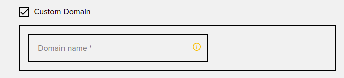

## Custom Domain at update

At application update, click the custom domain checkbox and enter the domain name in the input field. In case of a change in the domain name, you can re-enter the new name in the same input field.

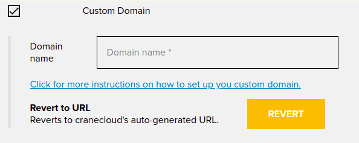

## Further Instructions

You can view instructions on how to set up your A-Records and what IPs you need to add click on the link that says `Click for more instructions on how to set up your custom domain`.

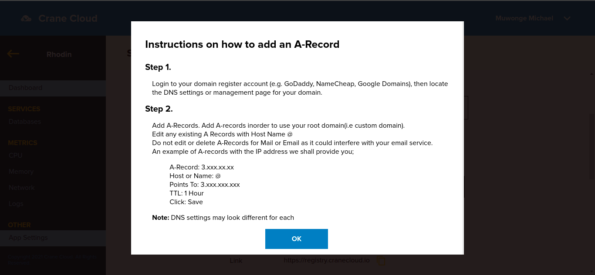

### Examples of how to set up A - Records for common DNS providers are as follows:

#### A: NameCheap
1. Login to your NameCheap account
2. Select Domain List from the left sidebar and click on the Manage button next to your domain.

   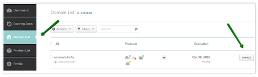

3. Navigate to the Advanced DNS tab at the top of the page:

   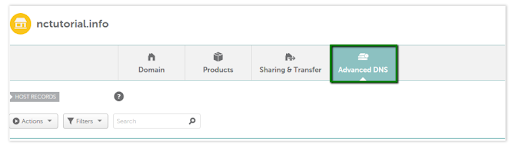

4. Find the Host Records section and click on the Add New Record button

   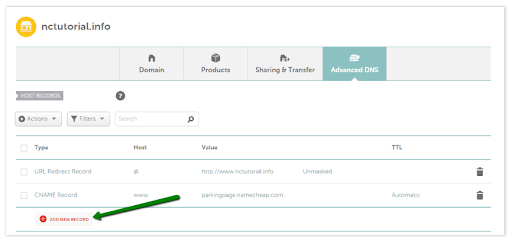

5. Select **A Record** for Type and enter the **Host** you would like to point to an IP address: (You will be issued IP addresses by the crane cloud admin).
@ - this is used to point a root domain (e.g yourdomain.co.uk)  to the IP address:

   **A Record | @ | 11.22.xx.xx**

   **www** - is selected when it is needed to point www.yourdomain.co.uk to the IP address:

   **A Record | www | 11.22.xx.xx**

   **[any host]** - you can insert any name of a subdomain that should be pointed to the IP address:
  
   **A Record | blog | 11.22.xx.xx**

   "*" - a wildcard record that matches requests for non-existent subdomains:
   **A Record | * | 11.22.xx.xx**

6. Once all the details are inserted, save them using the **Save Changes** green icon.(Typically, it takes about 30 minutes for newly created records to take effect)

**NB:** Make sure there are no conflicting records set for the same host and remove them if there are any. The records you need to check may be Unmasked/Masked/Permanent Redirect, A, or CNAME record types.

#### B:
1. Go to http://www.godaddy.com, sign in and click on Manage on the Domain row.
2. On the top of the screen, click on DNS and select Manage Zones.

    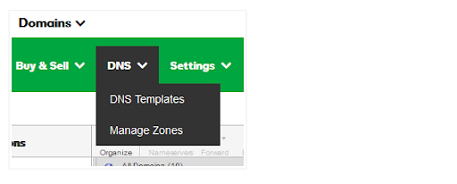

3. Find the domain for which you want to update the DNS records. Type the domain in the search box and click it.

    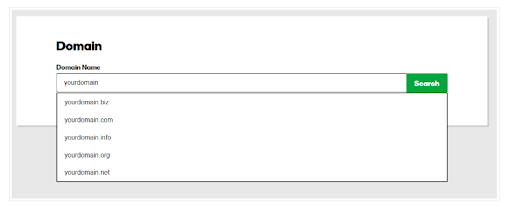

4. You will then be taken to the DNS records for that domain. For the A records;
   - If you already have an @ A record for the domain, click the pencil icon on the right of the entry and change the Value to the provided IP address e.g **54.247.91.xx.xx**

     Example of an old record;
  
      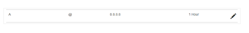  

     Example of a new record;

      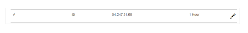

   - If you don’t already have an @ A record for the domain, click Add at the bottom right of the page, select A from the Type drop-down, enter @ in the Host field, and enter the IP given e.g **54.247.xx.xx.xx** in the value field, then click **Save**.

     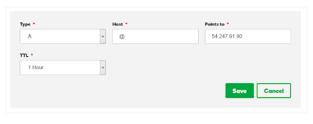

**Note: The steps to edit A records vary across different providers. A simple google search on how to edit A - Records of your provider should give you results.**

## Revert from custom domain

You can revert from custom domain by clicking on the `Revert` button. This will revert from a custom domain to a default domain that is a Creane Cloud issued URL.
