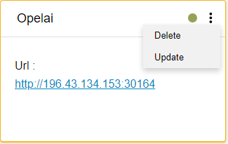
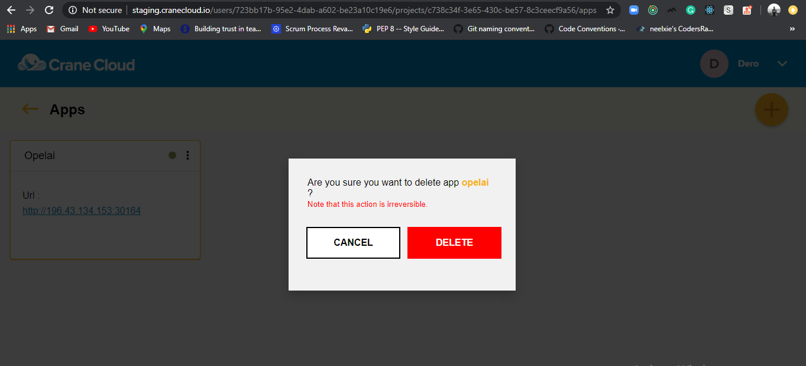

**Note: Once applications are deleted, the action is irreversible.**

Once inside your project select the individual application. Click the 3(three) *dots* on the top right side of the application card. A two-list context menu will appear as shown below.

Click the Delete option of the menu and a modal will appear similar to the one below.

Click the *Delete* button in red to effect the delete.

The application will be deleted.