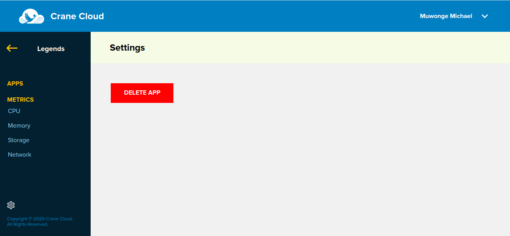
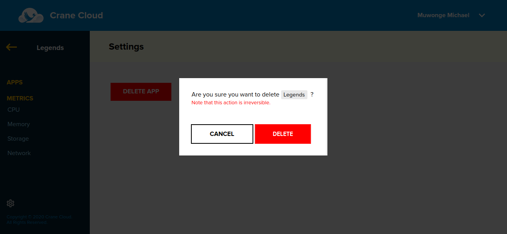

# Delete Deployed Application
**Note: Once applications are deleted, the action is irreversible.**
Once inside your project select the individual application. Click the settings icon on the bottom left of the page and a page will appear similar to that below.

Click the Delete option of the menu and a modal will appear similar to the one below.

Click the *Delete* button in red to effect the delete.

The application will be deleted.