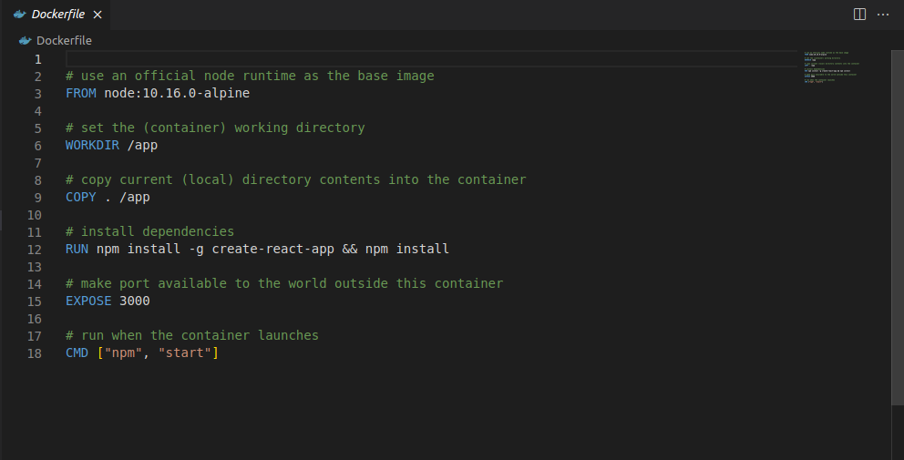
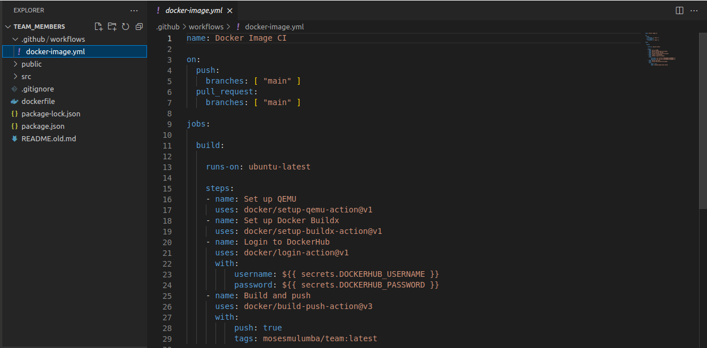
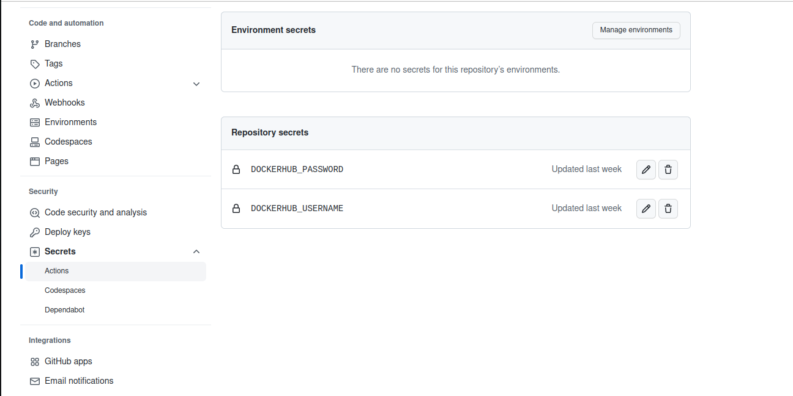
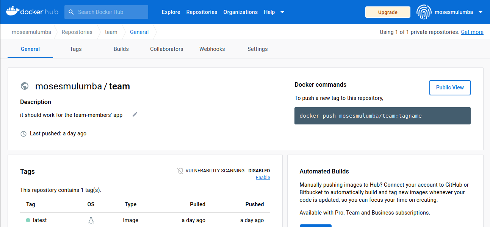

# Deployment of the application using Github Actions
 
Moses is a new user and he wishes to deploy an application to crane-cloud with the Github-Actions along-side the docker image.

_Lets see how he will go over it_

**Moses would need to follow through these steps below:**

Upon successful login into your Crane cloud account, and after successfully creating a project, you can now deploy your app with Github-Actions.

**Github-Actions**

1\. Since we are deploying the application along-side the docker image, you will first create the dockerfile locally in the repository directory.

2\. Then he will go on and create the .github folder which will house the workflows folder for the yaml file, which the user can name in his own way in the extension of .yml forexample *docker-image.yml* . Remember the yaml file contains the github serects which will help in the authentication of the user at the github account and also has the docker-image tag from the dockerhub repository.Actually the github serects are inform of username and user-password, these are credentials the user creates in the actions section on the remote repository of this repo, let me hope i am not over-straning you, i will explain more in the next section. Please try to follow up below.

3\. Here i will explain where you can get the github-action section and also the docker-image tag.When you are done working on your code and you feel you are more accurate, you take the step to push to a remote repository at your github account, hope you have created one.

*when logged in to your account, toggle to the settings of this particular repo your wish to deploy on crane cloud. And dive deep to the serects in the security section and create the repo serects.

 let me hope i am still with you here

*then lets see where to get the tag from. Basically i hope you have created a docker repository before. Now we will use that docker image as the tag and we fill it in the tags: section of the yaml file. And from here we will deploy the app at crane cloud following [sample-flask-app](../applications/dockerWithDB.md) or dockerWithDB.md in the applications drop-down.*

**_Note:_** These steps apply to all Apps whose images are stored on Dockerhub and contain the correct github serects [DOCKERHUB_USERNAME] and [DOCKERHUB_PASSWORD].