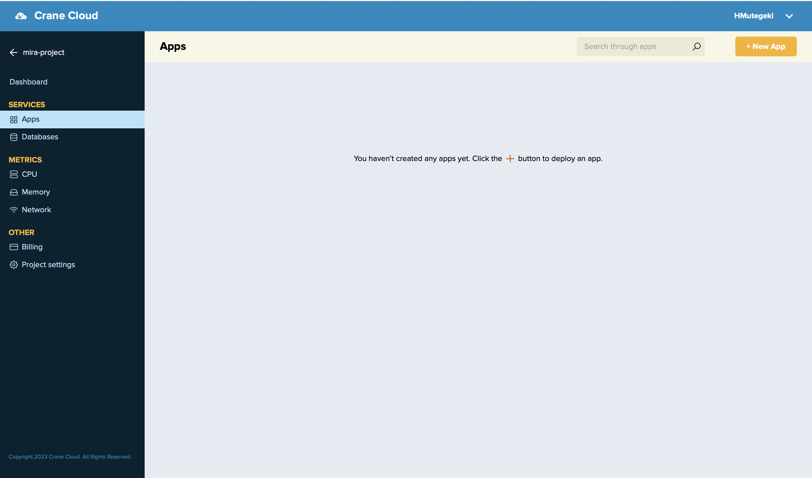
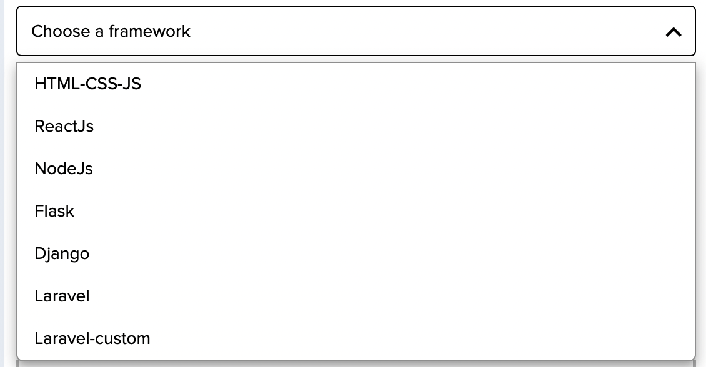
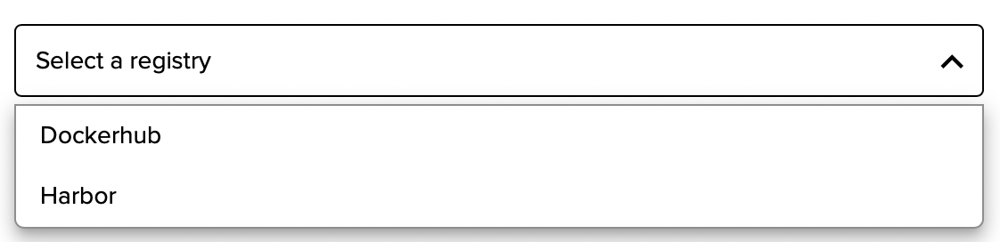
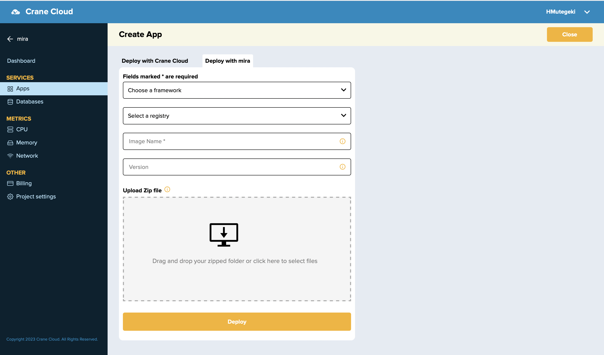
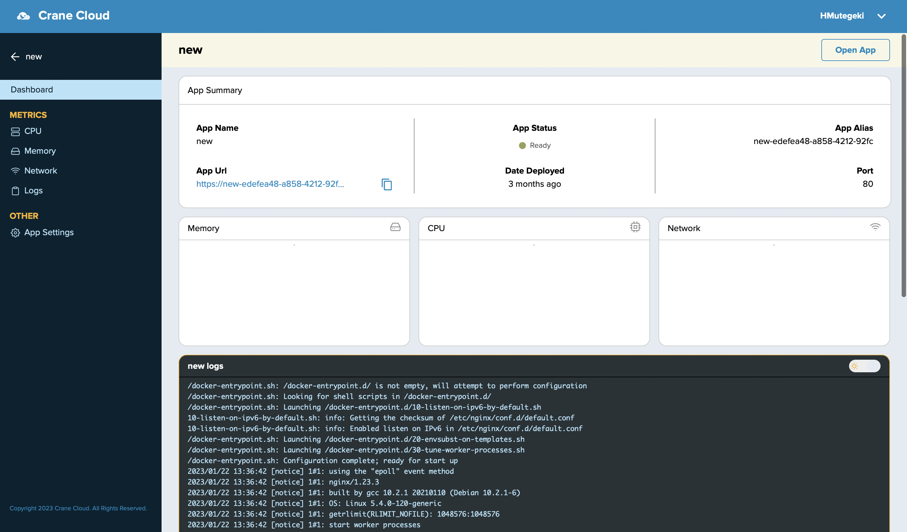

# Deploy An Application Using The MIRA Auto-containerization Service

Let's take a scenario where a user would like to deploy their react application to Crane Cloud but have little to knowledge on the containerization concepts. The Crane Cloud platform understands this kind of user and now supports for their needs through the MIRA service. 
Here, the user is exempted from going through the stages of image creation but rather are provided an interface where they can upload a zip file of their project code files and the platform does all the heavy lifting from image creation to application deployment. 

The supported frameworks by MIRA include: Html-Css-JS Apps, React, Flask, Django, NodeJS & Laravel. This list shall keep getting updated as we add more support.

_How would they do it via their Crane cloud account?_
They would need to follow through these steps below:

Upon successful login into your Crane cloud account, and after successfully creating a project, you can now deploy your app using the MIRA service.

**User Actions:**

1\. Drill into a project that you created of your choice, then navigate to the Apps tab on the left navigation bar and click the New App button in the top right corner of the application. This will pop up a modal containing a form that will help you deploy your application. 

2\. This modal has two tab options and you should select the tab labelled "Deploy with MIRA". The deployment modal will popup for you to fill and deploy an application. 

The first thing to select is the framework of the App you want to deploy. Select from the list of supported frameworks below. 

Then select a registry to which the resultant image will be stored. Here we offer 2 options in Harbor and Dockerhub. Harbor registry is a Crane Cloud self-managed & hosted registry for its users. DockerHub is a public registry for and the images generated through MIRA are stored under the cranecloud repository. 

The Image Name field will double as both the name of the resultant image and that for your application. The version field represents the image tag to help version the images. Then the upload field enables you upload a zip file of the codebase for the App in .zip format. 

3\. After filling all the required fields, go ahead to click the Deploy button then seat back and wait for your application to be provisioned.

**IF** the deployment was successful, the page will automatically display your new app and a URL on which to access it.

