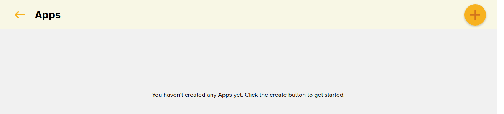
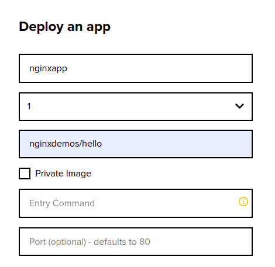
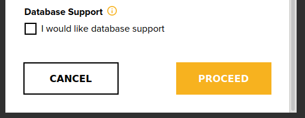

# Deploy Application Without Database Support
Allan is a novice DevOps learner and wants to figure out how to deploy a simple Nginx Application.

*How would he do it via his Crane cloud account?* 
Allan would need to follow through these steps below: 

Upon successful login into your Crane cloud account, and after successfully creating a project, you can now deploy your app which doesn't require database support. 

**User Actions:**

1\. Drill into a project that you created of your choice and click the plus button in the top right corner of the application. This will pop up a modal containing a form that will help you deploy your application.

2\. The deployment modal will popup for you to fill and deploy an application. 

3\. Fill in the form with your application-specific information like Application Name, Number of replicas, Link to Public image of the Application on any image registry like Docker and Environment Variables that are specific to your application. 

In case your application was designed to require an external entry command to trigger certain aspects of your application, then you should add the entry command. When the form is filled up, click proceed to deploy. Be sure not to check the Require DB field since your application doesn’t require it.

**IF** the deployment was successful, the page will automatically display your new app and a URL on which to access it.

These same steps can be used to deploy apps that don't require database support like React web Apps, and any other front end based apps. 
