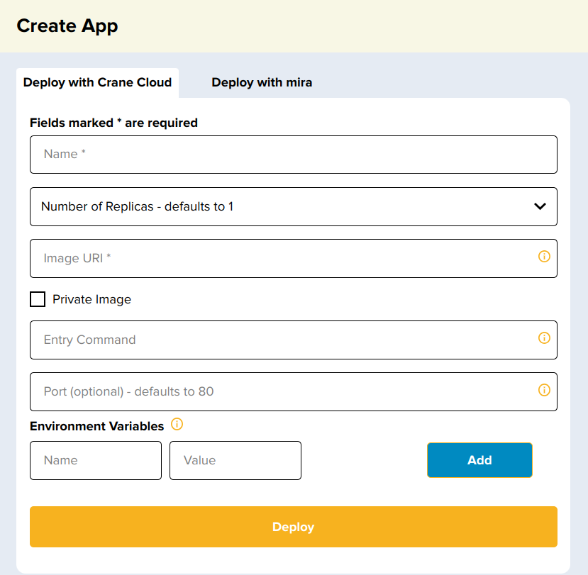
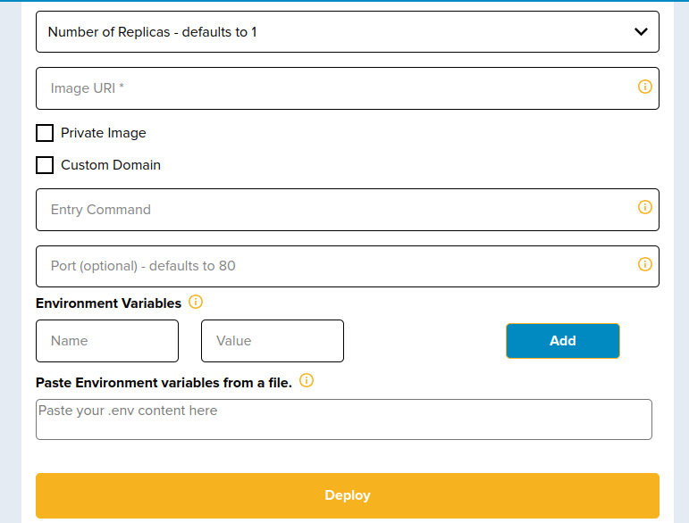
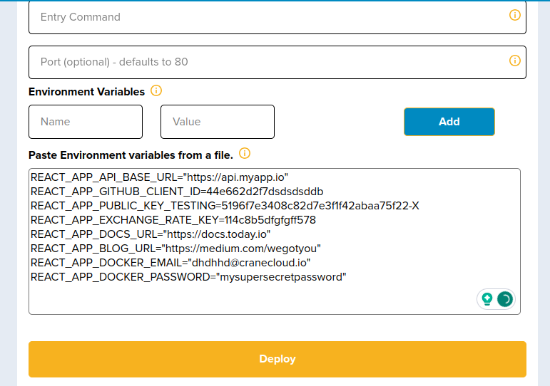

# Deploy Stand-alone Application

Allan is a novice DevOps learner and wants to figure out how to deploy a simple Nginx Application.

_How would he do it via his Crane cloud account?_
Allan would need to follow through these steps below:

Upon successful login into your Crane cloud account, and after successfully creating a project, you can now deploy your app which doesn't require database support.

**User Actions:**

1\. Drill into a project that you created of your choice and click the plus button in the top right corner of the application. This will pop up a modal containing a form that will help you deploy your application.

2\. The deployment modal will popup for you to fill and deploy an application. The Name field will be for your application name. In the example, "nginxapp" is the name. The number of replicas is optional. If not specified, it defaults to 1. The image uri, is the docker hub image link. The first part of it is the docker hub username and the second part is the image name - thus the syntax [username]/[image_name]. In the example below, "nginxdemos" is the dockerhub username and "hello" is the image name.

3\. Fill in the form with your application-specific information like Application Name, Number of replicas, Link to Public image of the Application on any image registry like Docker and Environment Variables that are specific to your application.

Avoid putting "spaces" when filing in the Name and image uri field else this will appear"Name may only contain letters,numbers,dot and a hypen -"

In case your application was designed to require an external entry command to trigger certain aspects of your application, then you should add the entry command. When the form is filled up, click proceed to deploy.

In case you have a list of environment variables, you can copy and and paste them in the text box availed and below is an example how they would look like.

**IF** the deployment was successful, the page will automatically display your new app and a URL on which to access it.

These same steps can be used to deploy apps that don't require database support like React web Apps, and any other front end based apps.
