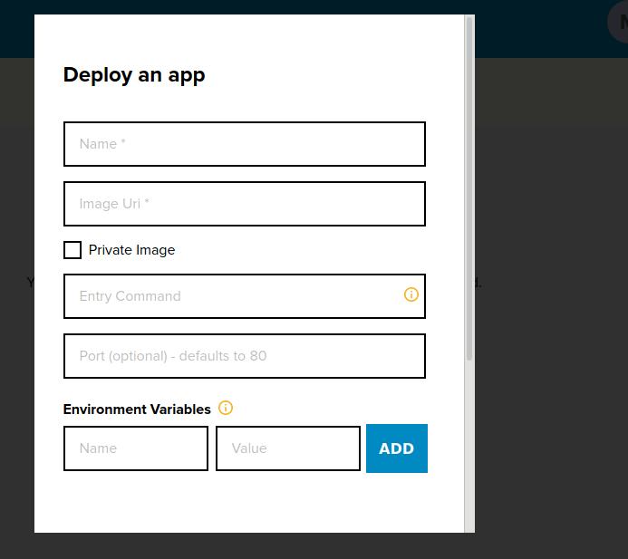

# Deploy An Application With Database Support Using A DockerHub Image 
John Doe supports the backend API of his company and they have been trying to explore the Crane cloud solution as a platform to host their backend APIs that require database support. He has his App image stored in the DockerHub image registry. 

Joe Doe would need to undertake the steps below to have the Flask API up and running with Postgres database support on Crane Cloud: 

**User Actions:**

1\. After logging in to your Crane Cloud Account and creating a Project, drill into a particular project. and click the *Create button* at the top right corner of the Apps dashboard page.

2\. A modal containing the App deployment form will then pop up.

3\.  IF the application image is a docker public image:

* Enter your App Name

* Enter absolute URL to the docker image

* Enter the entry command if any

* Enter the port on which you want your App to run (defaults to port 80)

* Enter and Add any App specific environment variables

* Check the box for Database Support

* Press the Proceed button

4\. IF the application image is a private docker image:

* Enter your App Name

* Enter absolute URL to the docker image

* Check the Private Image checkbox

* When checked, it displays a form for you to enter your DockerHub credentials used for authentication when the image is being pulled. In the server field, enter Url path to image 

* 

* Enter the entry command if any

* Enter the port on which you want your App to run (defaults to port 80)

* Enter and Add any App specific environment variables

* Check the box for Database Support

* Press the Proceed button

***Note:**  These steps apply to all Apps that require database support and whose images are stored on Dockerhub. Crane Cloud currently supports **Postgres Database.***
