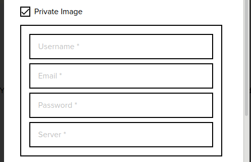

# Deploy An Application Image From GCR
Incase Joe Doe had his image stored on Google Container Registry (GCR) These are the steps that are quired to have the App up and running.

IF the application image is a GCR public image:

* Enter your App Name

* Select number of replicas for your app

* Enter absolute URL to the docker image

* Enter the entry command if any

* Enter the port on which you want your App to run (defaults to port 80)

* Enter and Add any App specific environment variables

* Press the Proceed button

* IF the application image is a private GCR image:*

 - Enter your App Name

 - Enter absolute URL to the docker image

- Check the Private Image checkbox

- When checked, it displays a form for you to enter your GCR  credentials used for authentication when the image is being pulled. 

- Provide your GCR  email. For the server, specify gcr.io and username _json_key

- The password field for GCR private images is a b64 encoded string of the JSON file containing your gcr credentials.

* 
* Enter the entry command if any

* Enter the port on which you want your App to run (defaults to port 80)

* Enter and Add any App specific environment variables

* Press the Proceed button

***Note:***  These steps apply to all Applications whose images are stored on GCR.
