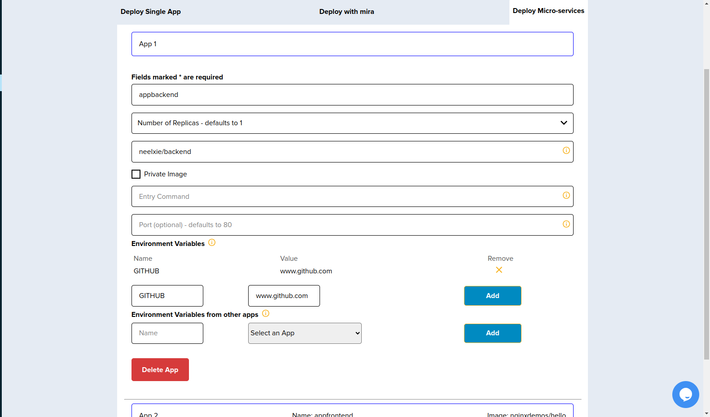
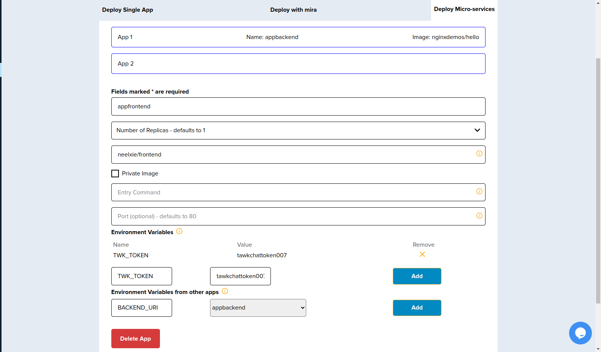
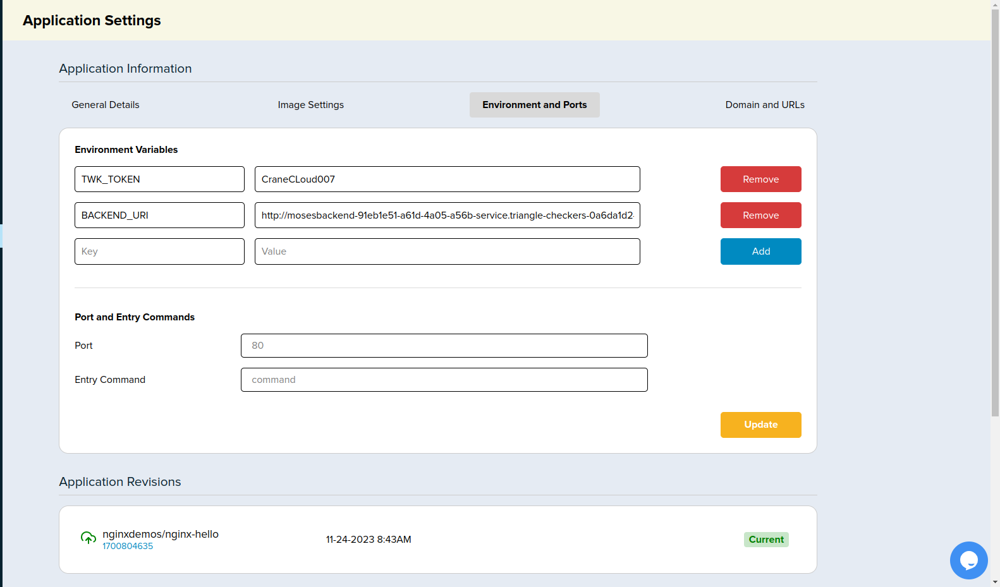

# Using Microservices

## Example

Let us assume a user wants to deploy two applications, a frontend and a backend.

When you click Create App butto the page will have provision for "Deploy Microservices" and the form ought to look like below:

Fill in the required details for the first application in our case the application is a backend we add any environment variables we have.

Afterwards we can go ahead and fill in the second application details. The section for environment variables from other Apps essentially means in our case we need to make use of the backend application url for use in the frontend, so we provide an environment variable name and select the backend app.

## Environment Variables

In your application settings page each application will have its environment variables in the _Environment Vars_ section.

