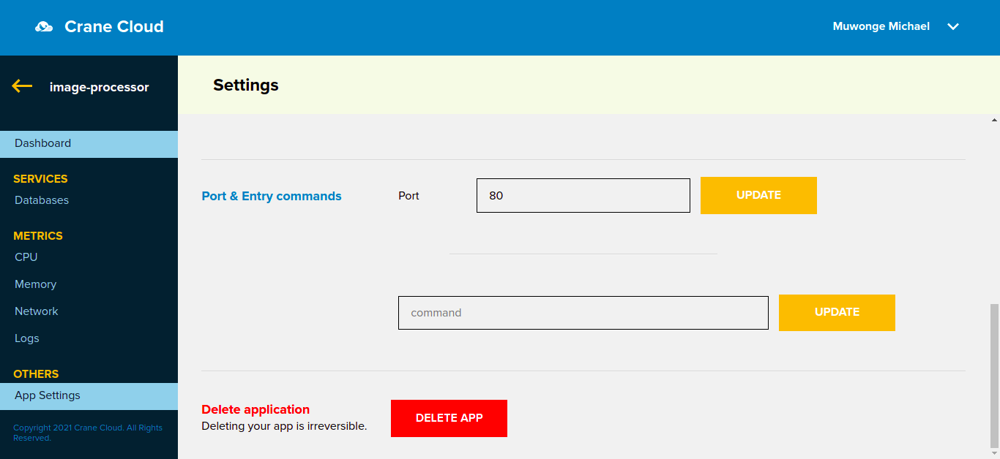

# Update Deployed Application

Once inside your project select the individual application. Click the settings link on the bottom left of the page and a page will appear similar to that below.

You can update the image uri to change the app deployment or you can select a new number of appliction replicas.

Incase you want to update the app to a different image, you can update the image uri. The new image can be a private imge in which case you click the checkbox  and fill in the necessary details
 

You can also update the application port and also add commands.

The application will be updated.