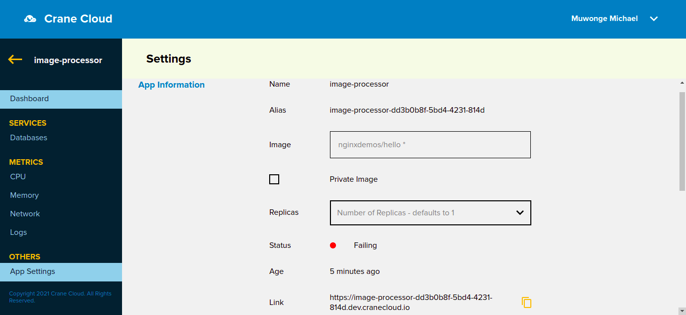
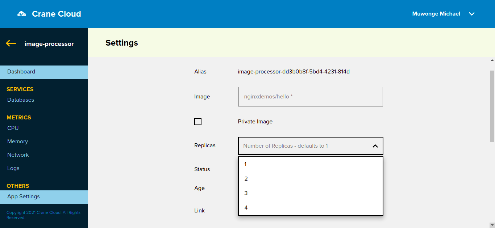
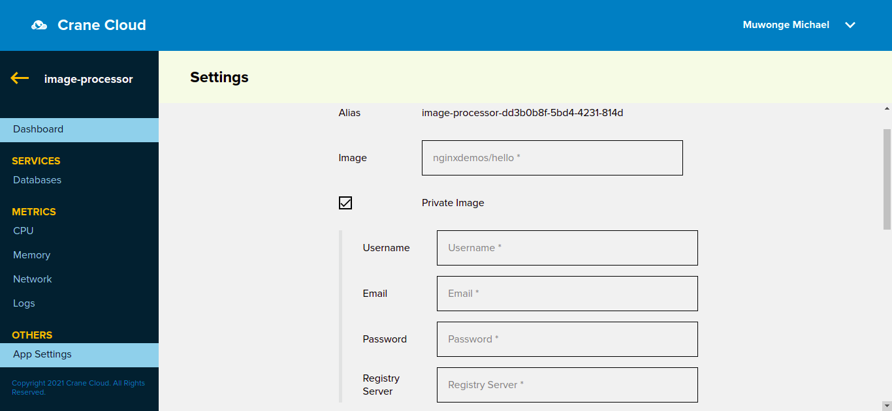
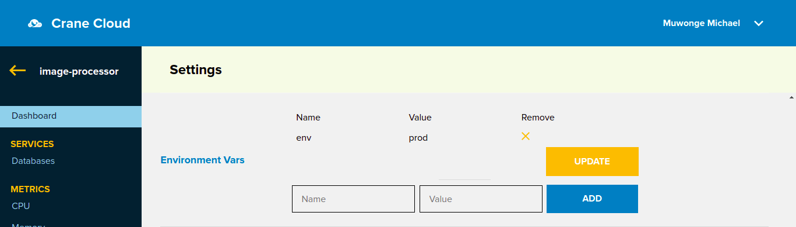
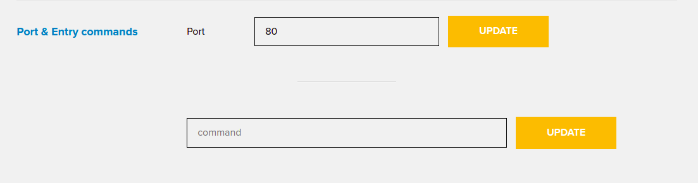

# Update Deployed Application

Once inside your project select the individual application. Click the settings link on the bottom left of the page and a page will appear similar to that below.

You can update the image uri to change the app deployment or you can select a new number of appliction replicas.

Incase you want to update the app to a different image, you can update the image uri. The new image can be a private imge in which case you click the checkbox  and fill in the necessary details
 

In case you forgot to add environment variables to your application you can add them in the *Environment Vars* section.

Environment variables are key-value pairs so you can fill in the key at name and value at value.

For example: If my app runs on 2 different environments and I wanted it to run on the prod(Production) environment, I would add that as an environment variable like below:

Click the update button and the environment variables would be added to the application.

In case an environment variable was added with a wrong value or need arises for change of an environment variable; then re-enter the key for that environment variable and enter the new value. The update will update the value.

You can also update the application port and also add commands.

The application will be updated.