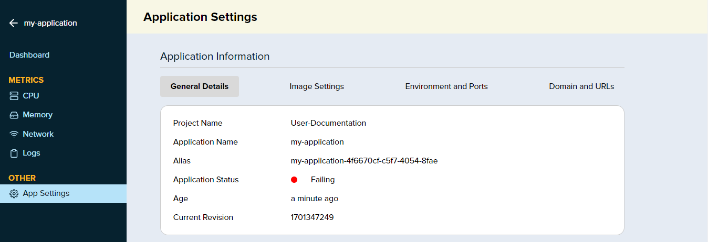
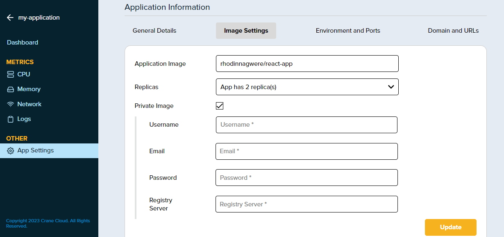
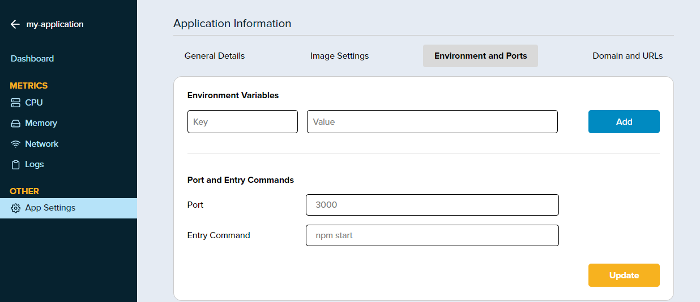
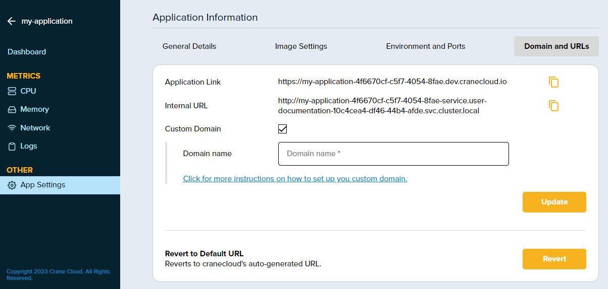
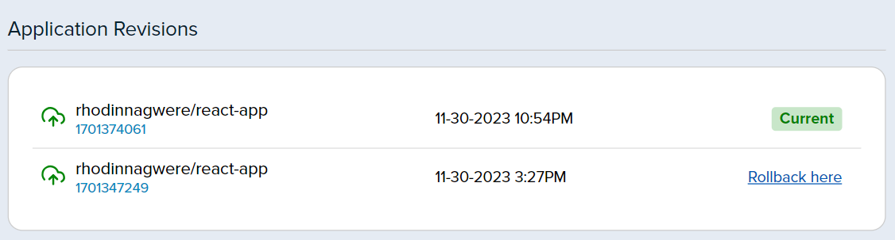

# Update Deployed Application

## Accessing the Application Settings Page

To update your application's settings, locate and select your application from the project dashboard, then navigate to the Application Dashboard and click on `App Settings` under the `Other` section from the sidebar.

Figure 1: The Application Settings Page

## General Details Section

Here, you will find the essential information about your application, including the Project Name, Application Name, Alias, Status, Age, and the Current Revision. This tab provides a quick summary of your application's current state and history.

## Image Settings Section

Figure 2: Image Settings

This section lets you configure the properties of the container image your application uses and here you can:

- `Application Image`: Specify the path to the container image in a registry from which your application should be deployed. For example, rhodinagwere/react-app would be the path to the Docker image on Docker Hub or another container registry.

- `Replicas`: Determine the number of instances (replicas) of your application that should be running. This is essential for load balancing and high availability.

- `Private Image`: If your image is hosted in a private repository, you would check this option, prompting you to provide authentication details.

- `Authentication Details`: When using a private image, you must enter the Username, Email, Password, and the Registry Server URL to access your private container image.

After updating the necessary fields, you would click the `Update` button to apply these settings to your application, which may involve pulling the specified image from the container registry and deploying the specified number of replicas.

## Environment And Ports Section

Figure 3: Environment and Ports

This section is essential for customizing your application's runtime environment. Here's how it works:

- `Environment Variables`: These are key-value pairs that affect the behavior of your application. You can set configuration options, such as API keys, database connections, or any other service credentials that your application needs to function properly. To add a new variable, enter the key in the `Key` field, the corresponding value in the `Value` field, and click `Add`.

- `Port`: This is where you specify the network port that the application listens on. It's important this matches the port your application is configured to expose, such as `3000` for many Node.js apps.

- `Entry Command`: This command is executed to start your application. For instance, `npm start` is a common start command for Node.js applications.

After configuring these settings, pressing the `Update` button will apply the changes, ensuring your application runs with the correct environment setup and listens on the specified port.

## Domain And URLs Section

Figure 4: Domain and URLs

Under this section you can manage how your application is accessed via the web. It includes:

- `Application Link`: This is the primary URL where users can access your application. It is typically a subdomain of the hosting service's domain, as shown in the example `https://my-application-...cranecloud.io`.

- `Internal URL`: This URL is used for internal communication within the hosting infrastructure and is not accessible from the public internet. It usually has a format like `http://my-application-...svc.cluster.local`.

- `Custom Domain`: If you have a custom domain name, you can configure it here to make your application accessible via a more personalized and professional web address. Check the box and fill in your custom domain name.

After entering a custom domain, you would click `Update` to apply the changes. If you need to revert to the default URL provided by the platform, you can use the `Revert` button, which will discard the custom domain settings and restore the platform's auto-generated URL. There's usually a link or instructions available to guide you through the process of setting up a custom domain if you're unfamiliar with the process.

## Application Revisions

Figure 5: Application Revisions Section

Application Revisions are a vital component of the application lifecycle management. The above section allows you to:

- `Track Changes`: Every entry in this section represents a distinct deployment or update that has been made to your application. It logs the image used (in this case, rhodinnagwere/react-app) along with a unique revision identifier.

- `Timestamps`: Each revision is timestamped, indicating exactly when the update was made. This can help you correlate changes with any variations in application performance or behavior.

- `Current State`: The revision currently deployed and serving your application is marked as `Current`. This helps you quickly identify which version is live.

If you encounter issues with the current version of your application, you can revert to a previous state by selecting `Rollback here` on an earlier revision. Rollback is a critical feature for maintaining stability, as it allows you to quickly undo changes that caused unexpected behavior or downtime.
