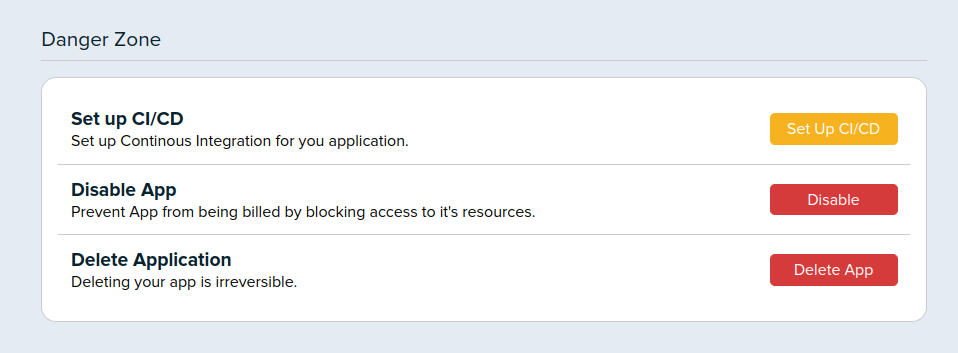
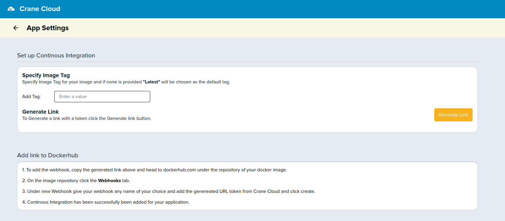
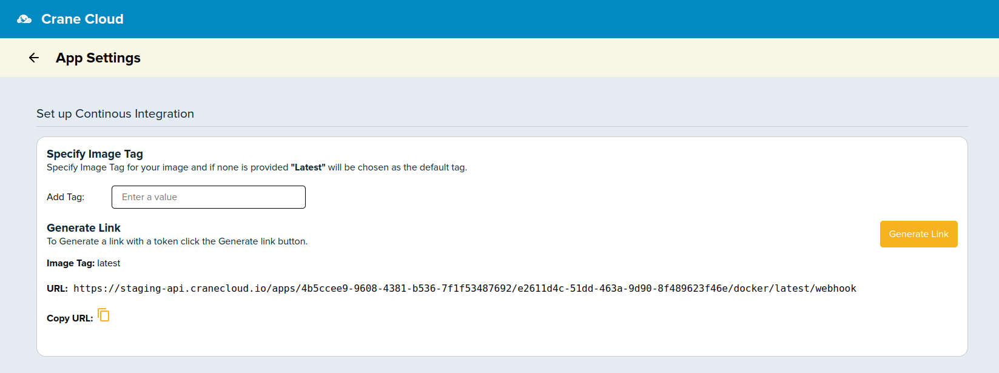
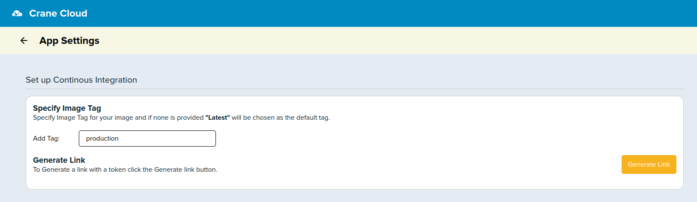
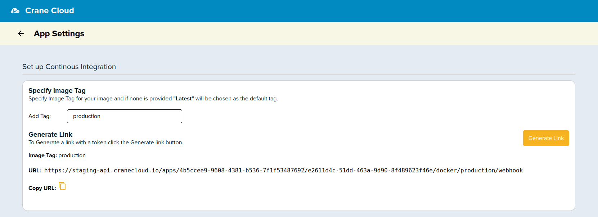
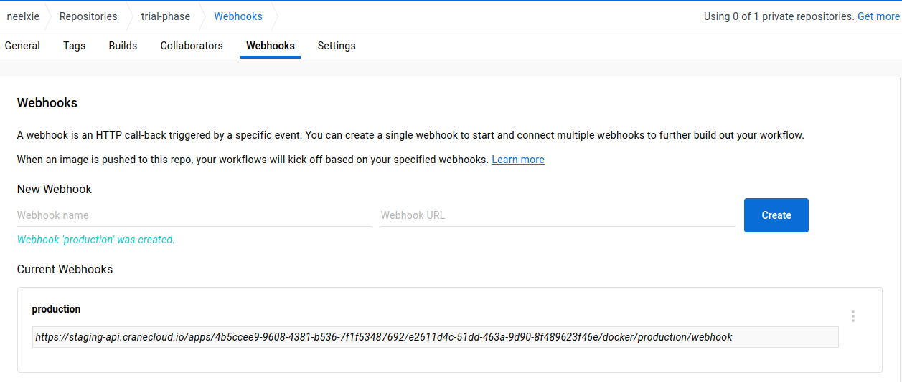

# Implement CI/CD with Dockerhub Web Hook

Incase Joe Doe had his image stored on Dockerhub and already running on Crane Cloud. These are the steps that are required to have the CI/CD working after changes to the Image

Once inside your app settings page. Scroll down to the "Danger Zone" and Click the "Set up CI/CD" button.

A new page will open and this is how it ought to look like.

By default if no tag is provided for your image, Crane Cloud assumes the tag "latest" just like Dockerhub and is able to still create a web hook link for you. All you have to do is click the "Generate link" button.

But in case you want to explicitly set the image tag, you can type it in the input field provided for example "production"

After inputting the tag you can go ahead and click to generate the relevant webhook URL

To make use of the generated webhook, head over to dockerhub.com and click under the specific repository for the image you deployed on Crane Cloud, and click the "Webhooks" tab. Fill in any name for your webhook and copy and paste the URL that was generated from Crane Cloud.

Once the webhook URL has been entered, you can now rebuild the image locally and push it to dockerhub, the subsequent changes will reflect.You can keep track of all the under the "App Revisions" section on the Application Settings' page.

