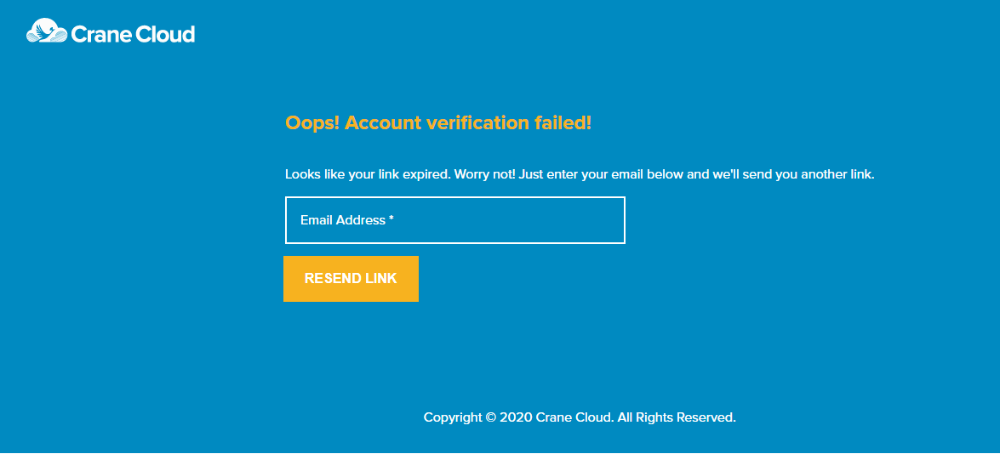

## Account Verification
1\. After signing up, a similar page like the one above prompts you to check your email for a verification link.

2\. You wiill recieve an email in Email Account.
    

3\. In your email either click the Confirm Account button or the link below and you will get signed into your account, the user dashboard.

**Ensure to verify your account as early as possible considering the link is sent with a token that expires.**

4\. In case you fail to verify your account as early as possible your token will expire and when you try to click it you will get this page.

- This will prompt you to re-enter your email and get sent another verification link.

If your token did not expire then you will be redirected to your user account dashboard.