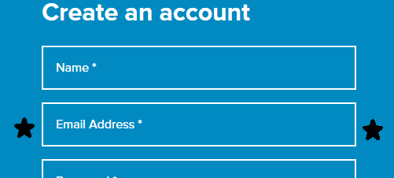

## Registration
1. To register visit cranecloud.io and click the `GET STARTED `Button

Alternatively you can click the `Create an account` link on the *Login page.*

2. The page below will appear with a form, go ahead to fill it

- In case you do not fill out any fields in the form, this error appears

3. When you fill in the `Name`, the name can be any alphanumeric value

- In case of an  error with the name like white spaces, this error shows

4. The Email input field should conform to a standard email.

- Incase of an error with this email field, the error below  will appear

5. 