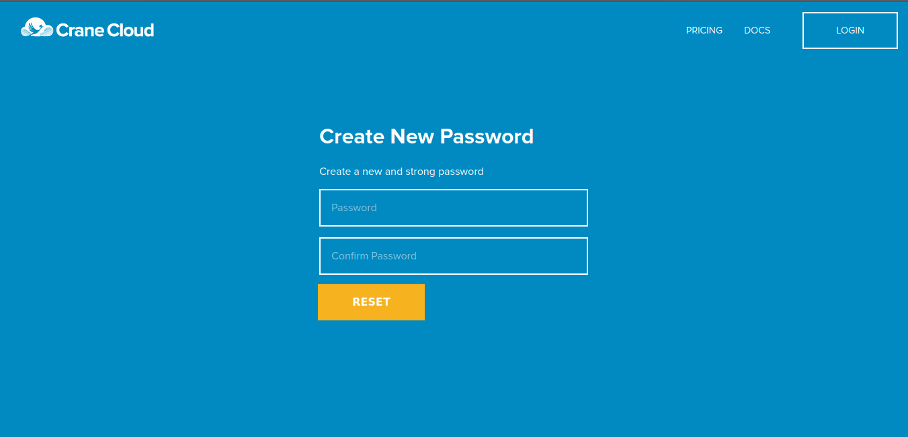

## Forgot Password
**User Actions:**

Once you click the forgot password link on the login page, it will lead you to this route <http://cranecloud.io/forgot-password> that displays a page for you to enter your email address.
Enter your email address corresponding to the one used at the time of account registration.

**Expected Behaviour:**

*IF* the email provided does not match any user account, the following error shall display, “Invalid user, please create an account “. You are required to navigate to <http://staging.cranecloud.io/forgot-password> and create an account with Crane Cloud in such a scenario.

*IF* the email provided is right and matches a registered account, a password update link shall be sent to your email. Note that the link will expire after 24 hours. Follow the link sent and it should land you to the page with provision to enter your new password.

On this page, you can create a new password that you then use to login to your account. 

In the event that the link expires before use, it shall lead you to page where you can re-submit your email address and receive a new link.