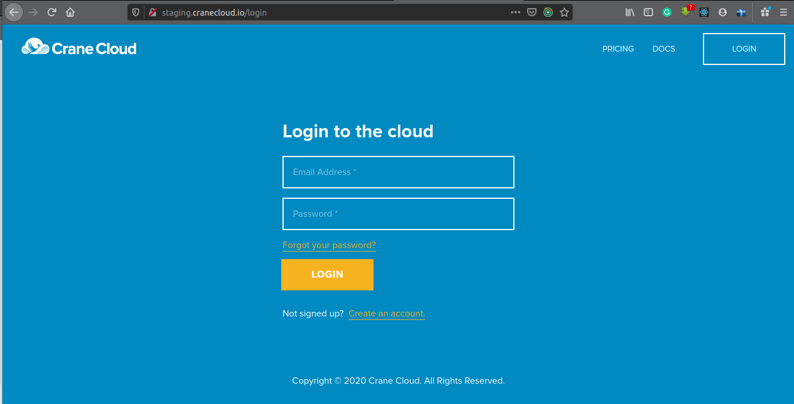

## Login
1\. Browse this URL <https://cranecloud.io/login> to access the Crane Cloud login portal, similar to the one below

Enter your email address and password, then  click LOGIN 

**Expected behavior:**

IF any field is left blank, the page throws an error saying “Please enter your email and password “ In this case, endeavor to have all the fields filled out and resubmit.

IF you entered wrong credentials, the page shall throw an error saying **Incorrect email or password** In that case, double-check your credentials and try again.  In the event that you don’t recall your password, click the Forgot password link just above the login button reset your password.

IF all the entered credentials are right, then you shall be redirected to your account dashboard.