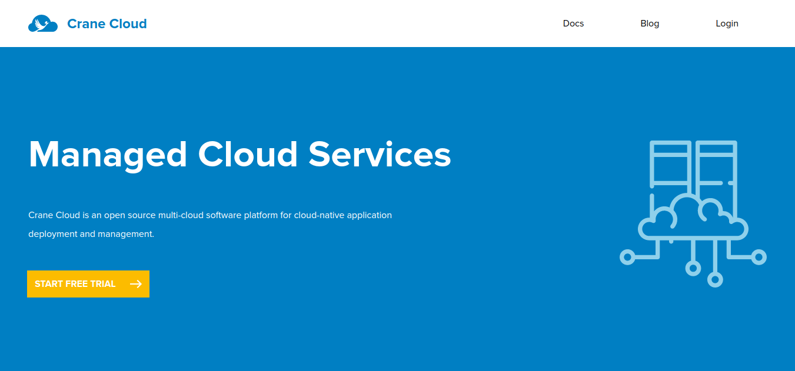
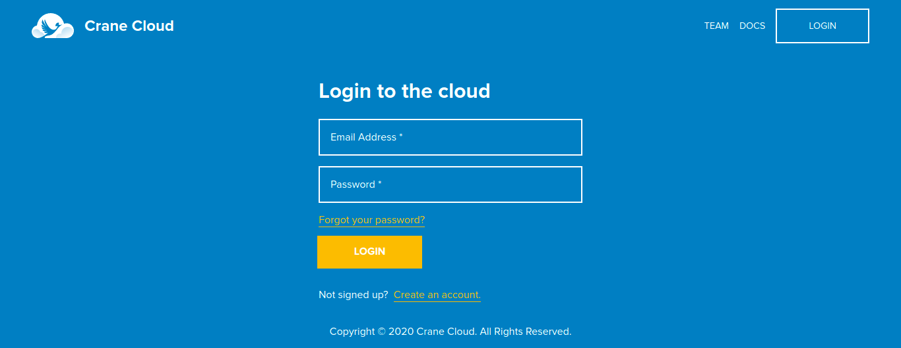
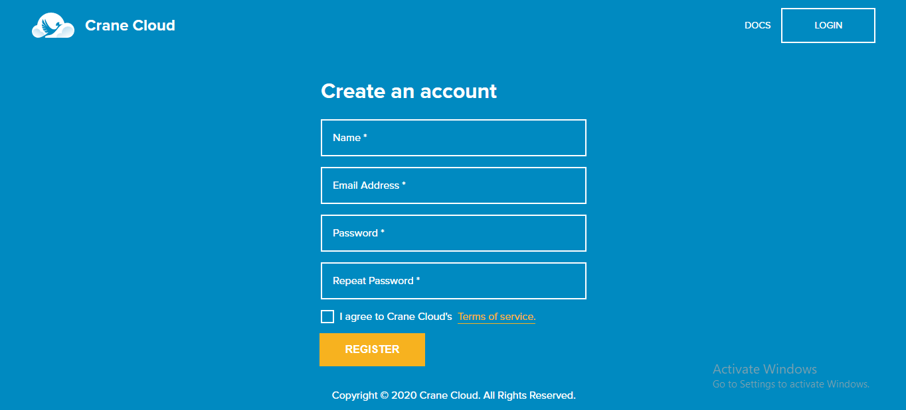
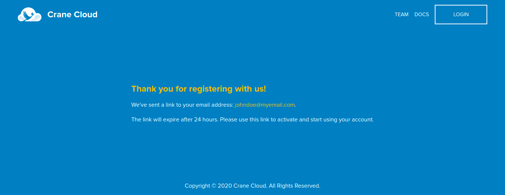

## Registration
1\. To register visit <https://cranecloud.io/> and click the `GET STARTED `Button

Alternatively you can click the `Create an account` link on the *Login page.*

2\. The page below will appear with a form, go ahead to fill it
    

In case you do not fill out any fields in the form, this error appears

3\. When you fill in the `Name`, the name can be any alphanumeric value

In case of an  error with the name like white spaces, this error shows
  

4\. The Email input field should conform to a standard email.

Incase of an error with this email field, the error below  will appear
  

5\. The password input fields should both have the same password

In case of an error with the password fields the error below will show

6\. **Please first read the `Terms of Service` before you click the checkbox.**

In case the checkbox is not clicked the error below appears
  

7\. Registering with an email already associated with an account on the platform, the error below is shown

8\. Upon successful registration you will see the page similar to the one below notifying you that an email has been sent to your entered email address and prompt you to check your email and proceed.
