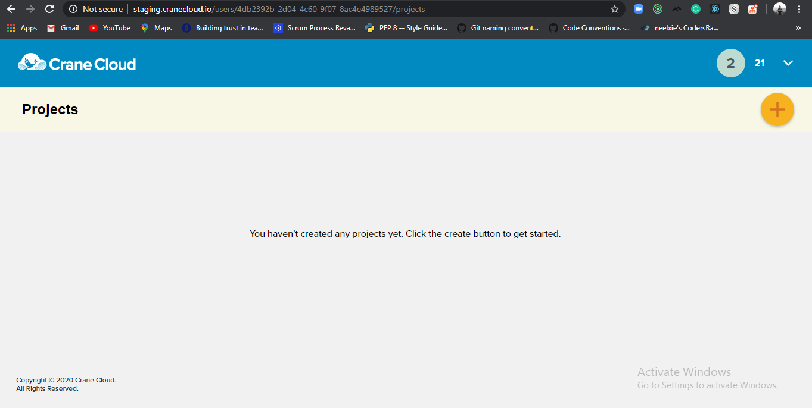
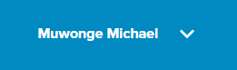

## User Dashboard

1\. Upon successful login, a page similar to this is seen containing all the projects you have available.

2\. And the page below in case you have no projects yet.
    

3\. Your name appears on the top right side of the page.

4\. Next to your name is a down arrow that once clicked displays a context menu.
  

You can click the Logout list item on the drop-down to log out of your account.