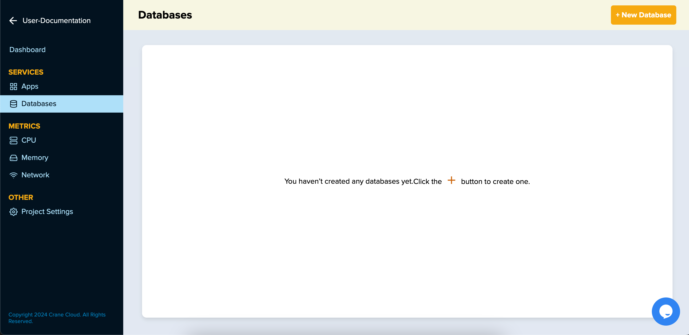
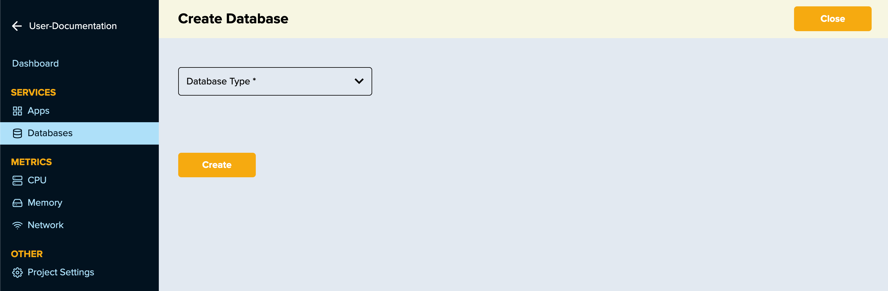
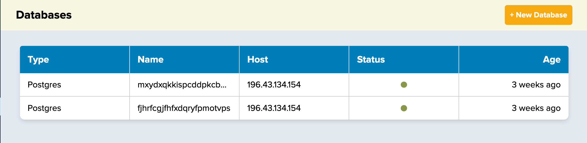
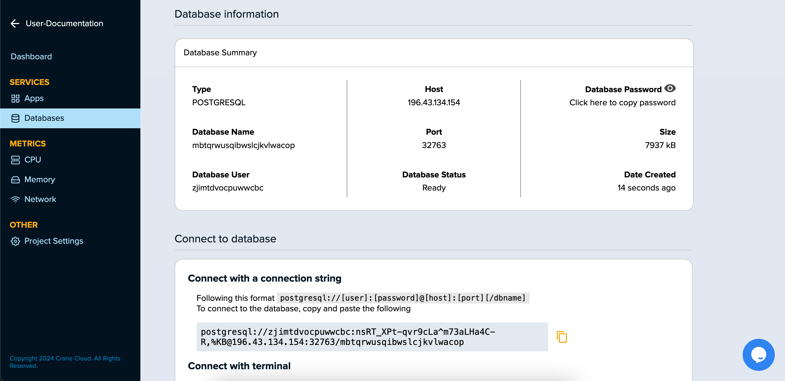
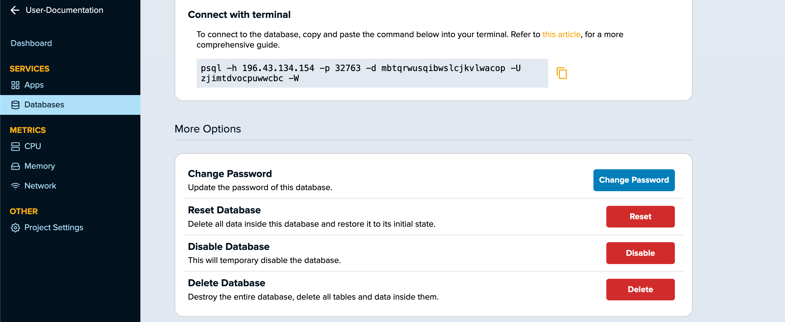
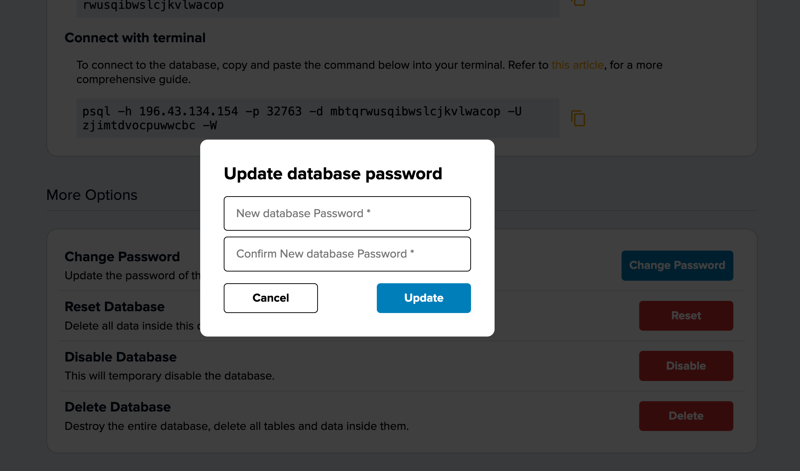
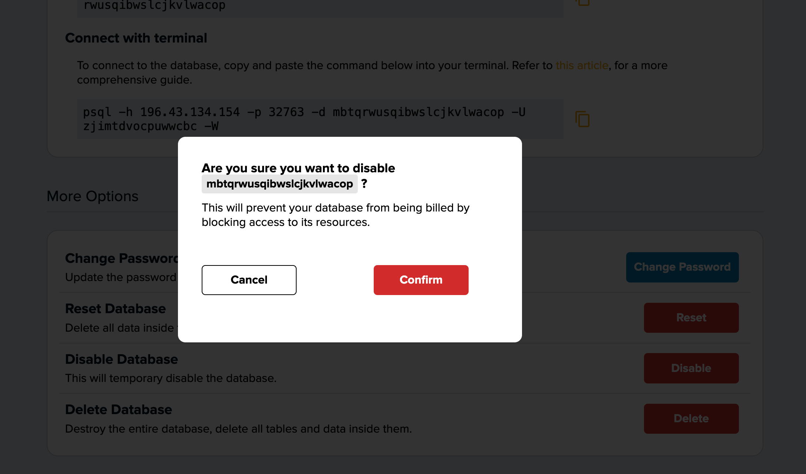
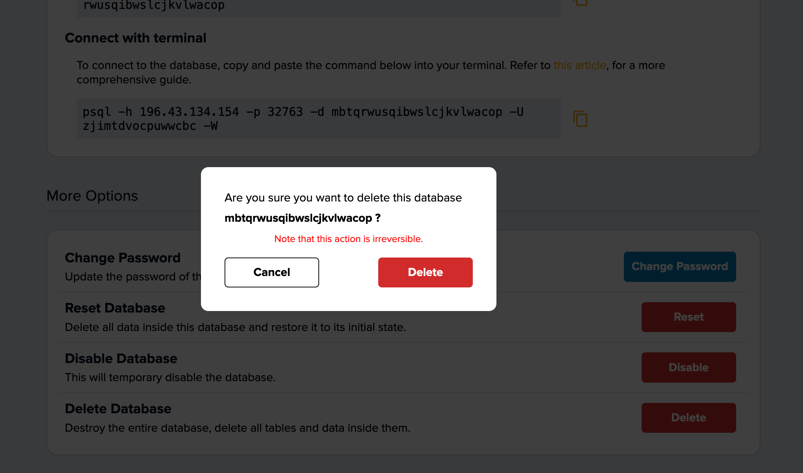

# Databases on Crane Cloud

Crane Cloud supports database as a service and this is done in just a few clicks.

## Create A Database

1. Navigate under a given project and proceed to the sidebar to select `Databases`

2. Click on the `+ New Database` button at the top right hand side of the screen.

   

Once the button is clicked, a page containing a form to create a database will be shown as below

- Select database type from drop-down.
- Click the `Create` button to submit the form.
- The page will reload and display your newly created database.
- Once the database has been successfully created it will show in the user dashboard.

To access a particular database, click on the database to proceed to the database settings page that will show as below

You can read instructions on how to access your newly created database as well as the provision to copy database credentials.

## Change Database Password

1. Navigate to the `More Options` section within the database settings page

2. Proceed to click on the `Change Password` button.

3. On clicking the button, a modal appears prompting you to go ahead and change the database password.

   

### Possible Warnings

- If the password entered is too short, the system will prompt you to enter a password of atleast 8 characters.
- If the password entered is too long, the system will prompt you to enter a password of atmost 32 characters.
- If the passwords entered do not match, the system will prompt you to enter the same password.

## Reseting A Database

1. Navigate to the `More Options` section within the database settings page

2. Proceed to click on the `Reset` button.

3. On clicking the button, a modal appears prompting you to go ahead and reset the database.
   

**_ Once you click the reset button, you will be unable to recover the deleted database tables and data therein. _**

## Disabling A Database

1. Navigate to the `More Options` section within the database settings page

2. Proceed to click on the `Disable` button.

**_ Once you click the disable button, you won't be able to access your database. _**

## Deleting A Database

1. Navigate to the `More Options` section within the database settings page

2. Proceed to click on the `Delete` button.

3. On clicking the button, a modal appears prompting you to go ahead and delete the database.
   

**_ Once you click the delete button, you will be unable to recover the deleted database. _**
