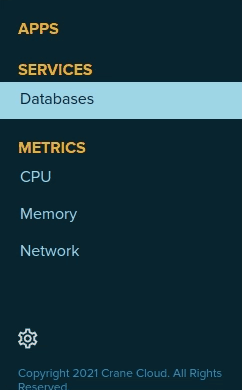
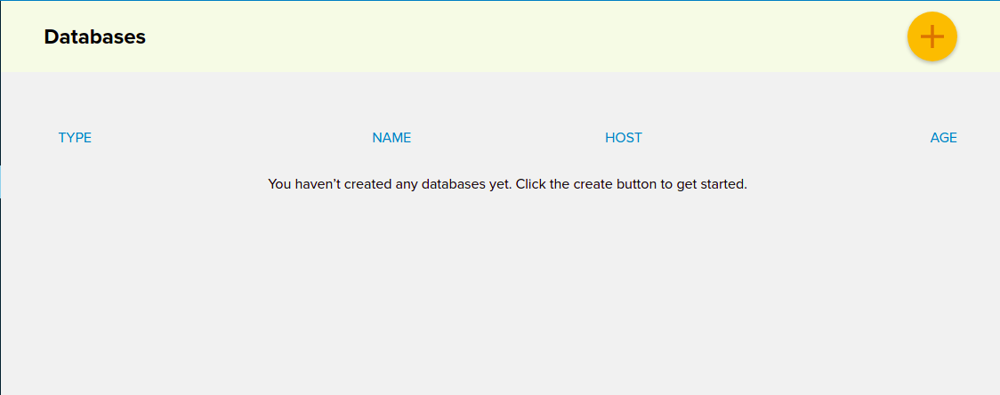
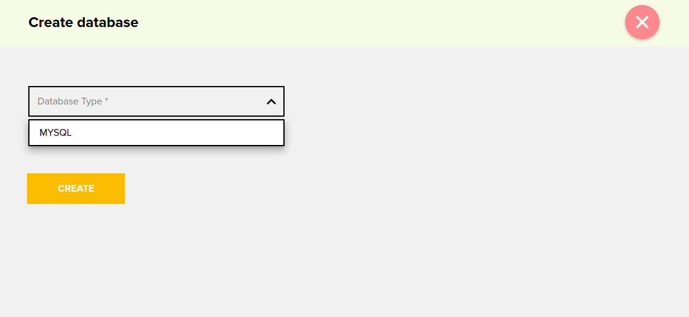
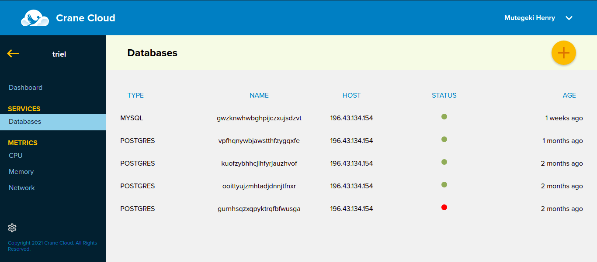
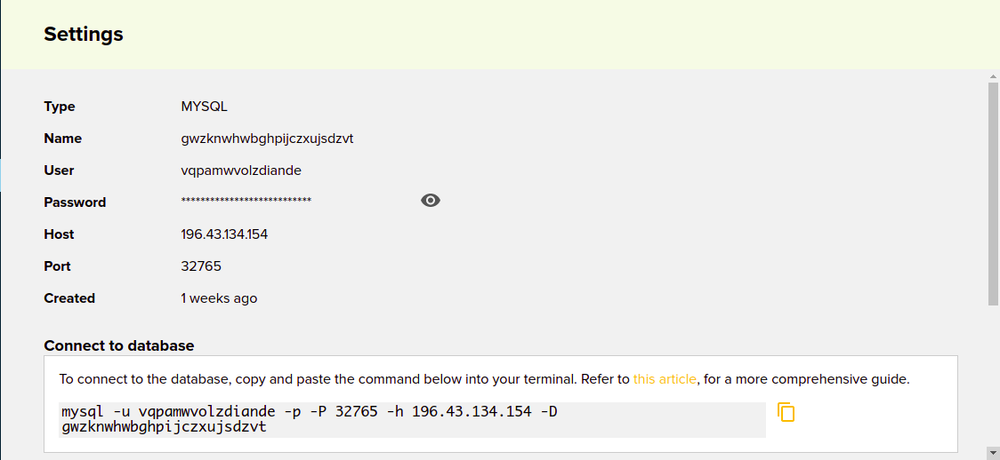
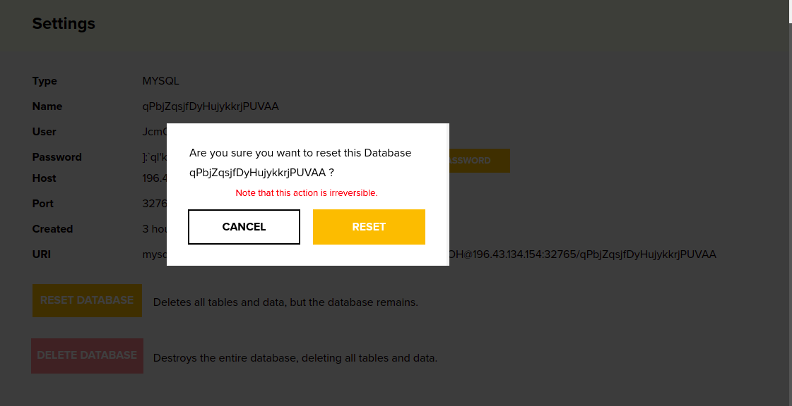
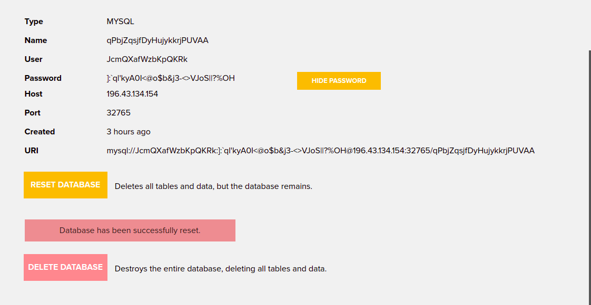
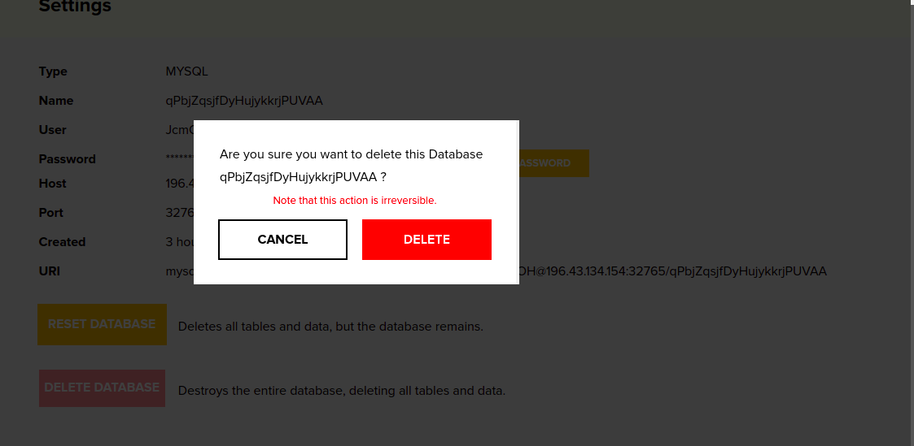

# DATABASE
Crane Cloud supports database as a service and this is done in just a few clicks.

## Create A Database
1. To create a database, navigate to the User dashboard, Select a Project you want to create a database in.

2. Under the navigation sidebar select databases.

    

3. Click on the `ADD` button at the top right hand side of the screen.
 

4. Once the button is clicked, a page containing a form to create a database.

5. Let us use a case study: Create a MYSQL database. 

    - Select database type from drop-down.
    - Click the `CREATE` button to submit the form.
    - The page will reload and display your newly created database.
    - Once the database has been successfully created it will show in the user dashboard.
    
    

6. Incase you did not select a Database type you will get an error message.
 

7. To access a particular database, click on the database card to drill in.

## Reseting A Database

1. To reset a database, click a database from the database list.

2. Once inside the database,an apps page appears similar to that one below.

    

3. On the database settings page, click on the `RESET DATABASE` button on at bottom of the page. 

4. On clicking the button, a modal appears prompting you to go ahead and reset the database.
    

5. Click the *RESET DATABASE* button and the database will be reset.

*** Once you click the reset button, you will be unable to recover the deleted database tables and data therein. ***

## Deleting A Database

1. To delete a database, click a database from the database list.

2. Once inside the database, on the database settings page, click on the `DELETE DATABASE` button on at bottom of the page. 

4. On clicking the button, a modal appears prompting you to go ahead and delete the database.
    

5. Click the *DELETE DATABASE* button and the database will be deleted.

*** Once you click the delete button, you will be unable to recover the deleted database. ***
