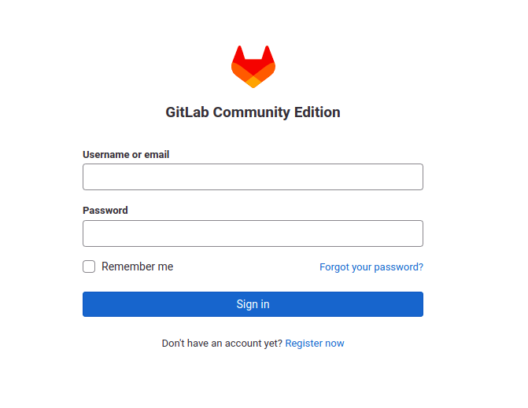
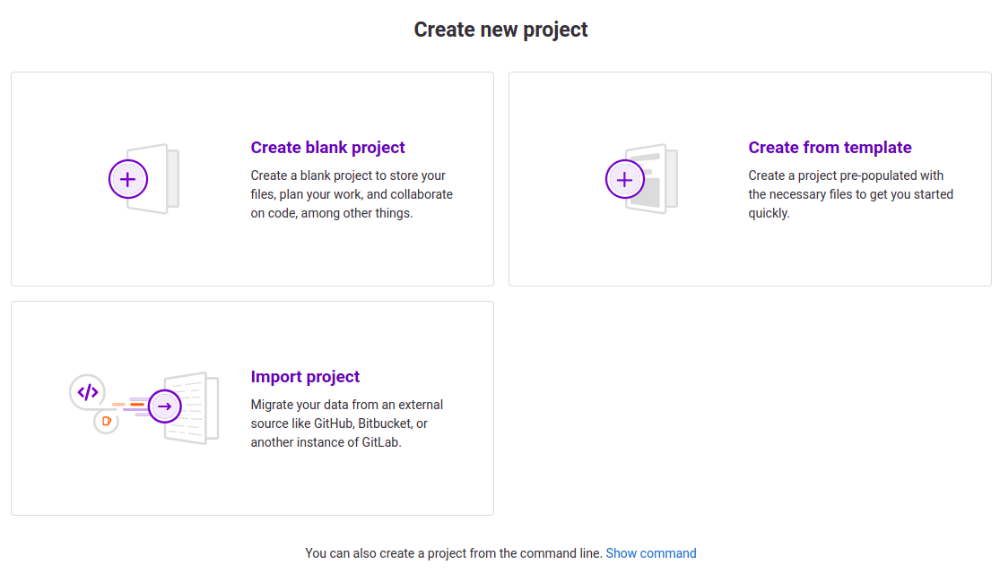

# GITLAB

## Gitlab Self Managed Configuration
After successfully, deploying a dockerised application using the Gitlab Community docker image, the setup configuration steps are detailed below.

## GitLab launching
Our self-managed GitLab is available at the given app deployment URL which can be found on your Cranecloud app dashboard. The following screen should appear: The first launch may take several minutes.
 
 Figure 1: GitLab CE login page

After logging in, the following screen should appear in figure 2:

 

## Initial configuration of the portal

The initial configuration involves changing a few portal settings. First, turn off open registration for everyone so that only users authorized by the admin can complete registration. This can be done by clicking the view settings button available on the upper bar with a warning. On the new page, uncheck Sign-up enabled and save the changes.

The next step should be to change the root user. To do this go under profile and then account settings and enter the name in the Change username field. Approve by clicking on Update username.

The last step will be the change password under the profile page, enter a temporary and new password and then approve the change by clicking save password.

## Create a new repository

After the initial configuration, we can create our first repository. To do this, go to the page at projects/new and click create a blank project or Import project.

 

 Figure 3: Project creation page

You can import a project by selecting Import project from Repo from URL, then providing the Git repository URL address. After a while, your first repository will be copied to your Gitlab.

 

 Figure 4: Project Import

## Creating a CI/CD pipeline
To create a CI/CD pipeline for the project, click the main menu on the left, CI/CD, and then Editor. An option to create a `.gitlab-ci.yml` file, which will contain our pipeline definitions, will appear on the screen. This file will be created in the Git repository.

Once the CI file is committed and approved, GitLab will launch the process. To check the results, go to CI/CD -> pipelines in the menu on the left. On the screen, we should see that our first task has already been started.

We can go to the details of this task by clicking on the pending button or build number #1. After a while, the task should be built and tested.

## Cloning a project
To clone a project, Consider copying the url in the browser search bar at the top while in the root view / initial view of the project and run the command as follows eg `git clone https://gitlab-ce-32b64b3f-fc91-4331-bf7e.cranecloud.io/Alex/Flipper.git` where `https://gitlab-ce-32b64b3f-fc91-4331-bf7e.cranecloud.io/Alex/Flipper` is the copied url in your editor terminal instead of using gitlab's derived clone command 
