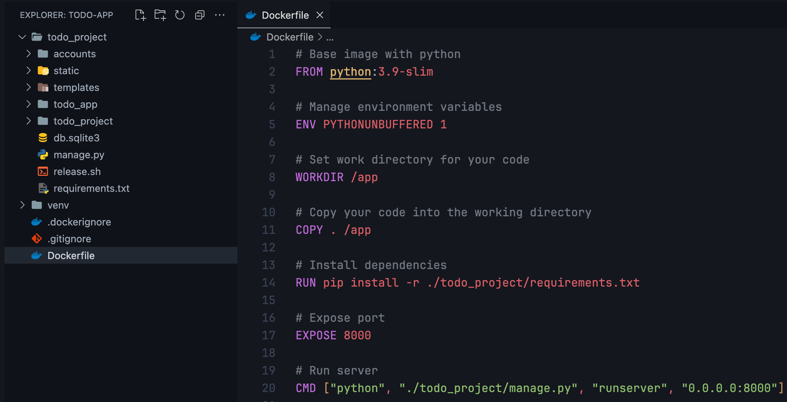
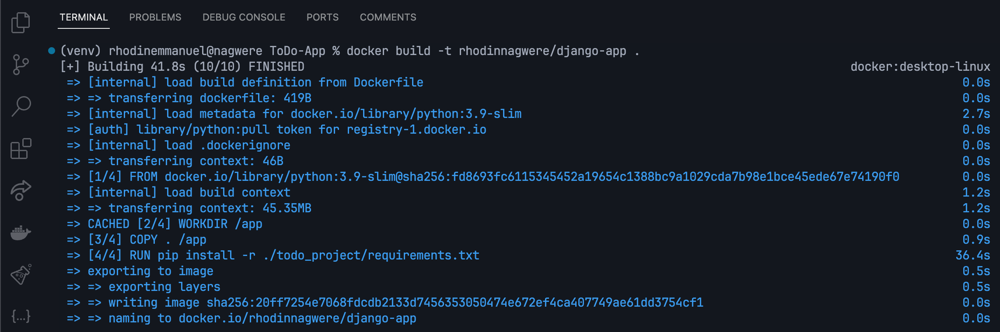
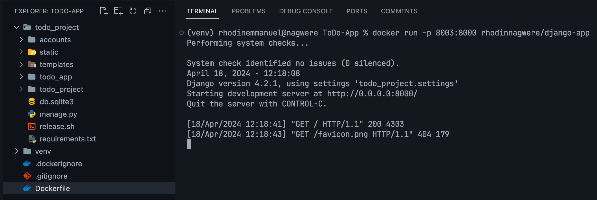
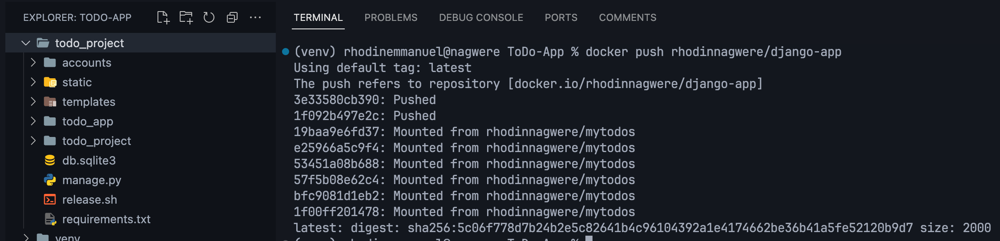
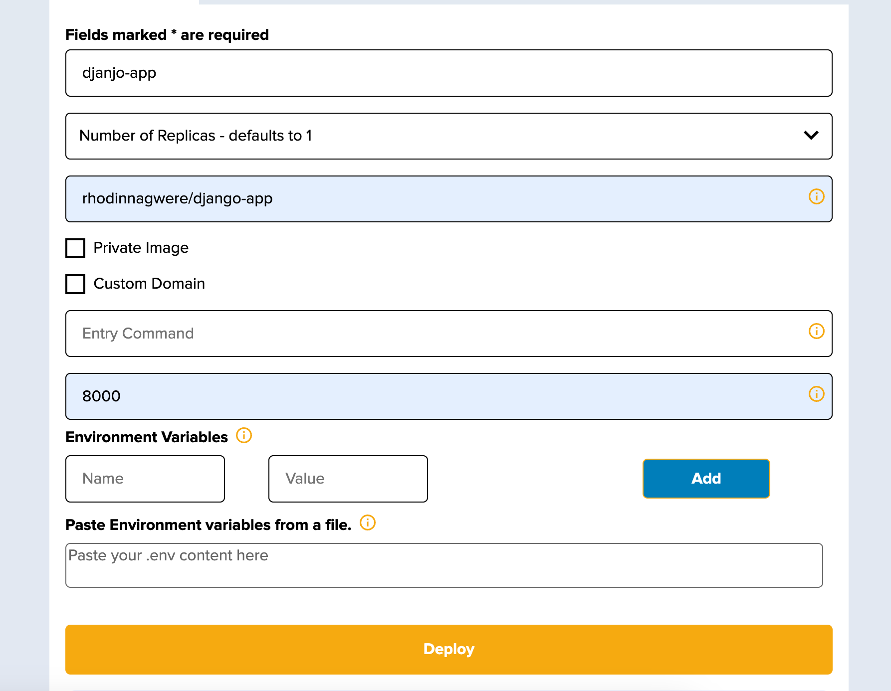
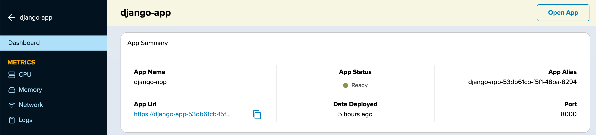

Getting an application running on Crane Cloud is essentially working out how to package it as a deployable image. Once packaged it can be deployed to the Crane Cloud platform.

In this guide, we will learn how to containerize a sample django application using Docker and then deploy to Crane Cloud. See [demo here](https://django-app-53db61cb-f5f1-48ba-8294.cranecloud.io)

## Prerequisites

Before we begin, we assume that you already have the following:

1. Fork [sample-django-app](https://github.com/crane-cloud-Apps/sample-django-app) on Github.

2. Docker installed on your machine. If you haven't got Docker installed, you can use [this resource](https://docs.docker.com/get-docker/) to get you up and running.

3. Docker Hub account. If you need to create one first, [click here.](https://hub.docker.com/signup)

## Create a Dockerfile for your app

In our application's directory, we shall create a `Dockerfile` and in it, let us write the following commands

```js
# Base image with python
FROM python:3.9-slim

# Manage environment variables
ENV PYTHONUNBUFFERED 1

# Set work directory for your code
WORKDIR /app

# Copy your code into the working directory
COPY . /app

# Locate your requirements.txt file and install dependencies
RUN pip install -r ./todo_project/requirements.txt

# Expose port
EXPOSE 8000

# Run server
CMD ["python", "./todo_project/manage.py", "runserver", "0.0.0.0:8000"]
```

After the step above, you should have something like this



## Build a Docker Image for your app

You must note that the Dockerfile is like the heart of our dockerization process, without it we cannot build a Docker image for our application. We can therefore build our docker image by running this command `docker build . -t  <yourDockerHubUsername>/django-app`

- `<yourDockerHubUsername>/django-app` is the image name I chose for this guide, but you can provide any name of your choice.



## Run our Docker Image locally

To confirm that the image was successfully built, run `docker run -p 8003:8000 rhodinnagwere/django-app`. This will run our containerized app locally on `port 8000`.

- The `-p` flag redirects a public port to a private port inside the container and the private port in this case is the port value `8003` we exposed in our Dockerfile while building the image.



## Push local Docker Image to Docker Hub

We also need to access DockerHub in order to push our local image to our newly created project.

Before we can push the image, we need to tag it. Docker tags are a way of referring to your image that conveys useful information about its version. This is done in the format `docker tag <local-image-name> <yourDockerHubUsername>/<project-name>:<version>`

- `rhodinnagwere` is my DockerHub username
- `rhodinnagwere/django-app` is the DockerHub repository I have created and after it is a tag `latest`

After adding a tag to your image, you can proceed to push your local image along with its tag to DockerHub using the command `docker push rhodinnagwere/django-app:latest`



## Deploy to Crane Cloud

- Login to your Crane Cloud account, incase you do not have one you can simply create one by visiting [here](../authentication/registration.md)

- From your dashboard create a project, you can see how its done [here](../projects/projects.md)



After providing the above information, we can then deploy our app by clicking the `DEPLOY` button.



Our Django application is successfully deployed on Crane Cloud.

Thank you for following this guide.
