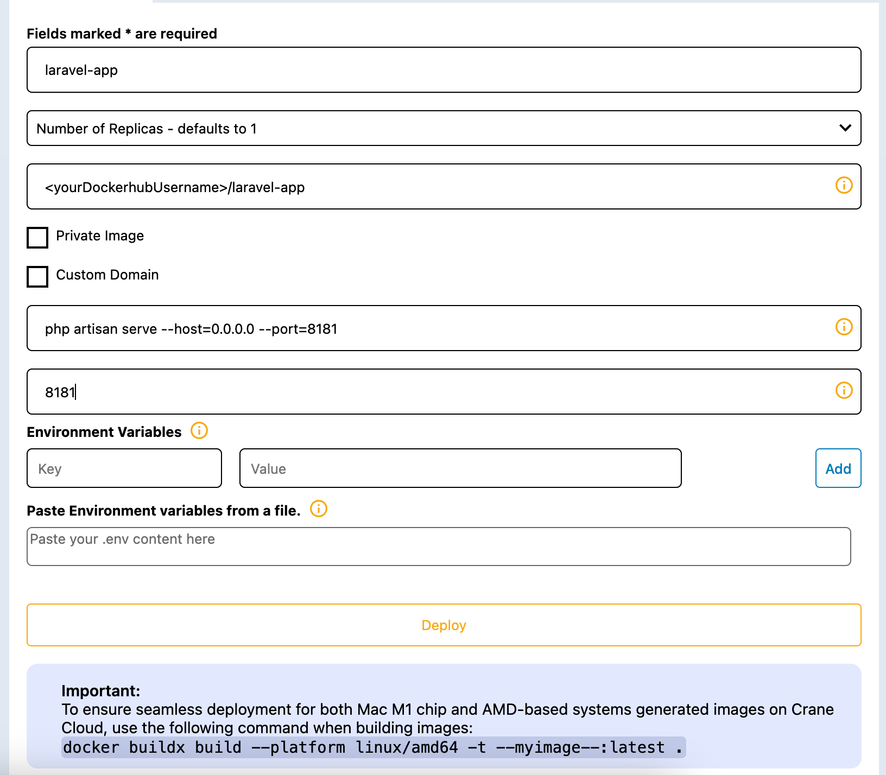

Getting an application running on Crane Cloud is essentially working out how to package it as a deployable image. Once packaged it can be deployed to the Crane Cloud platform.

In this guide, we will learn how to containerize a sample Laravel Application using Docker and then deploy to Crane Cloud.

## Prerequisites

Before we begin, we assume that you already have the following:

1. Fork <a href="https://github.com/crane-cloud-Apps/sample-laravel-app" target="_blank" rel="noopener noreferrer">sample-laravel-app on Github.</a>

2. Docker installed on your machine. If you haven't got Docker installed, you can use <a href="https://docs.docker.com/get-docker/" target="_blank" rel="noopener noreferrer">this resource</a> to get you up and running.

3. Docker Hub account. If you need to create one first, <a href="https://hub.docker.com/signup" target="_blank" rel="noopener noreferrer">Click here</a>

## Create a Dockerfile for your app

In our application's directory, we shall create a `Dockerfile` and in it, let us write the following commands

```js
# Use the official PHP image as the base image
FROM php:8.1-rc-zts-alpine3.16

# specifies a working directory for our source code
WORKDIR /app

# copies your source code files along with the package file
COPY . /app

# install composer in your container
RUN curl -sS https://getcomposer.org/installer | php -- --install-dir=/usr/local/bin --filename=composer

# install PHP PDO mySQL extension
RUN docker-php-ext-install pdo_mysql

# install dependencies
RUN composer install

# specifies a port number for our image to run in a docker container
EXPOSE 8181

# command to run our docker image in container
CMD php artisan serve --host=0.0.0.0 --port=8181
```

## Build a Docker Image for your app

You must note that the Dockerfile is like the heart of our dockerization process, without it we cannot build a Docker image for our application. We can therefore build our docker image by running this command `docker build -t <yourDockerhubUsername>/laravel .`

- `<yourDockerhubUsername>/laravel` is the docker image name I chose for this guide, whereby `<yourDockerHubUsername>` should be replaced by your DockerHub account username.

## Run our Docker Image locally

To confirm that the image was successfully built, run `docker run -p 8082:8181 <yourDockerhubUsername>/laravel`. This will run our containerized app locally on `port 8082` which can be accessed in your browser at `http://localhost:8082`

- The `-p` flag redirects a public port to a private port inside the container and the private port in this case is the port value `8181` we exposed in our Dockerfile while building the image.

Next, we are going to push our local image to DockerHub so that we can access our application remotely and deploy it on Crane Cloud.

## Push local Docker Image to Docker Hub

We also need to access DockerHub in order to push our local image to our newly created project.

Inorder to do that, run `docker login` and authenticate with your DockerHub credentials

Before we can push the image, we need to tag it. Docker tags are a way of referring to your image that conveys useful information about its version. This is done in the format `docker tag <local-image-name> <yourDockerhubUsername>/<project-name>:<version>`

In our case, this will be `docker tag <yourDockerhubUsername>/laravel <yourDockerhubUsername>/laravel:latest`

- `<yourDockerhubUsername>/laravel` is the DockerHub repository I have created and after it is a tag `latest`

After adding a tag to your image, you can proceed to push your local image along with its tag to DockerHub using the command `docker push <yourDockerhubUsername>/laravel:latest`

## Deploy to Crane Cloud

- Login to your Crane Cloud account, incase you do not have one you can simply create one by visiting [here](../user-accounts/registration.md)

- From your dashboard create a project, you can see how its done [here](../projects/index.md)

- Inside that project, you create an app called `laravel-app` as illustrated below



After providing the above information, we can then deploy our app by clicking the `DEPLOY` button.

Thank you for following this guide.
