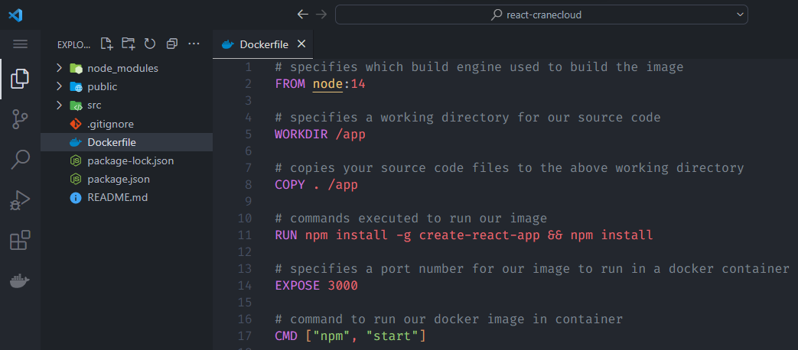
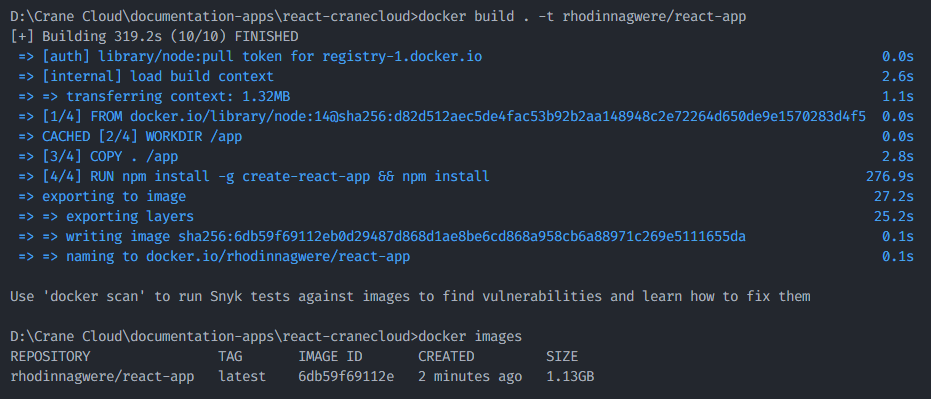
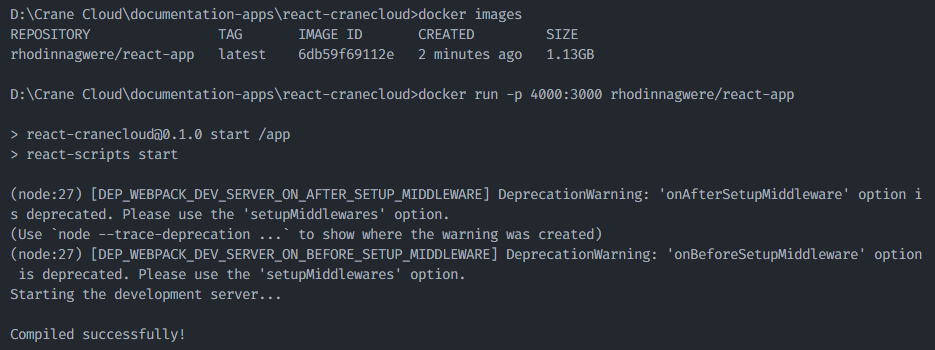
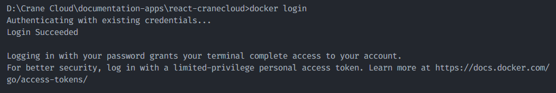
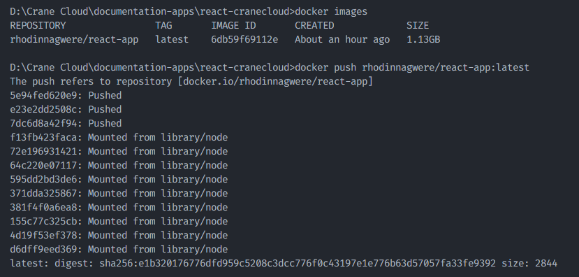
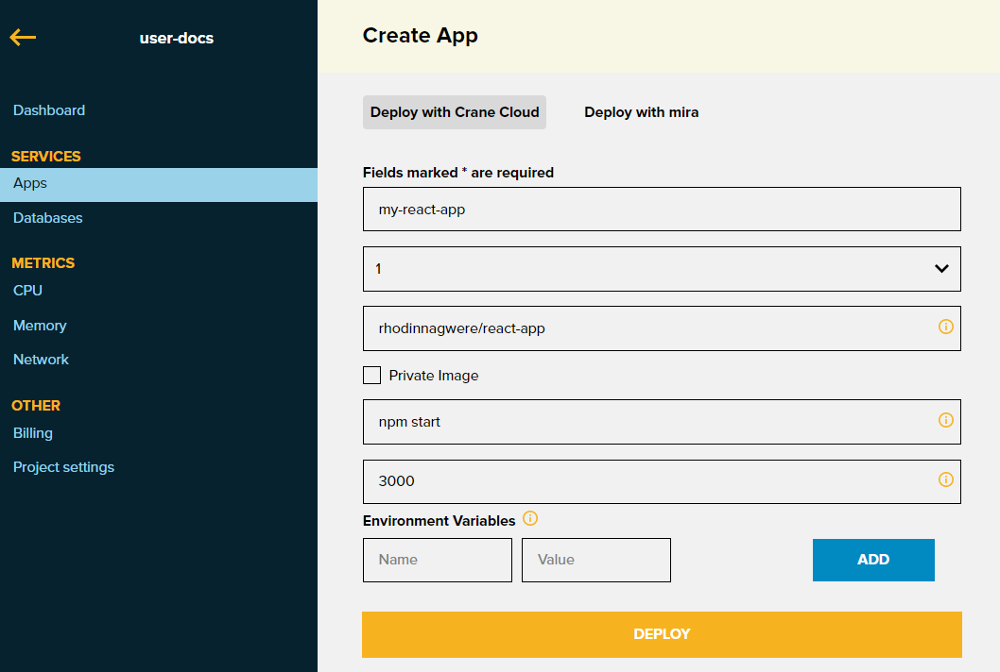
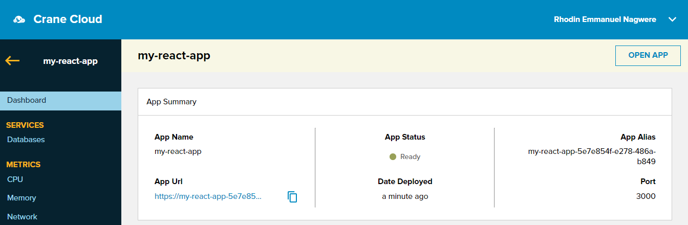

Getting an application running on Crane Cloud is essentially working out how to package it as a deployable image. Once packaged it can be deployed to the Crane Cloud platform.

In this guide, we will learn how to containerize a sample React Application using Docker and then deploy to Crane Cloud. See [demo here](https://my-react-app-5e7e854f-e278-486a-b849.cranecloud.io/)

## Prerequisites

Before we begin, we assume that you already have the following:

1. Fork [sample-react-app](https://github.com/crane-cloud-Apps/sample-react-app) on Github.

2. Docker installed on your machine. If you haven't got Docker installed, you can use [this resource](https://docs.docker.com/get-docker/) to get you up and running.

3. Docker Hub account. If you need to create one first, [click here.](https://hub.docker.com/signup)

## Create a Dockerfile for your app

In our application's directory, we shall create a `Dockerfile` and in it, let us write the following commands

```js
# specifies which build engine used to build the image
FROM node:14

# specifies a working directory for our source code
WORKDIR /app

# copies your source code files to the above working directory
COPY . /app

# commands executed to install dependencies
RUN npm install -g create-react-app && npm install

# specifies a port number for our image to run in a docker container
EXPOSE 3000

# command to run our docker image in container
CMD ["npm", "start"]
```

After the step above, you should have something like this



## Build a Docker Image for your app

You must note that the Dockerfile is like the heart of our dockerization process, without it we cannot build a Docker image for our application. We can therefore build our docker image by running this command `docker build . -t  rhodinnagwere/react-app`

- `rhodinnagwere/react-app` is the image name I chose for this guide, but you can provide any name of your choice.

You can check the available images built after the build process is done using the command `docker images` in your terminal as illustrated below.



## Run our Docker Image locally

To confirm that the image was successfully built, run `docker run -p 4000:3000 rhodinnagwere/react-app`. This will run our containerized app locally on `port 4000` which can be accessed in your browser at `http://localhost:4000`

- The `-p` flag redirects a public port to a private port inside the container and the private port in this case is the port value `3000` we exposed in our Dockerfile while building the image.



Next, we are going to push our local image to DockerHub so that we can access our application remotely and deploy it on Crane Cloud.

## Push local Docker Image to Docker Hub

We also need to access DockerHub in order to push our local image to our newly created project.

Inorder to do that, let us run `docker login` and authenticate with our DockerHub credentials as illustrated below. Now we are successfully logged in to DockerHub on our terminal.



Before we can push the image, we need to tag it. Docker tags are a way of referring to your image that conveys useful information about its version. This is done in the format `docker tag <local-image-name> dockerUsername/<project-name>:<version>`

In our case, this will be `docker tag rhodinnagwere/react-app rhodinnagwere/react-app:latest`

- `rhodinnagwere` is my DockerHub username
- `rhodinnagwere/react-app` is the DockerHub repository I have created and after it is a tag `latest`

After adding a tag to your image, you can proceed to push your local image along with its tag to DockerHub using the command `docker push rhodinnagwere/react-app:latest`



## Deploy to Crane Cloud

- Login to your Crane Cloud account, incase you do not have one you can simply create one by visiting [here](../authentication/registration.md)

- From your dashboard create a project, you can see how its done [here](../projects/projects.md)

- Inside that project, you create an app called `my-react-app` as illustrated below and incase you do not know how that is done, learn from [here](../applications/deployApp.md)



After providing the above information, we can then deploy our app by clicking the `DEPLOY` button.



Our react application is successfully deployed on Crane Cloud.

Thank you for following this guide.
