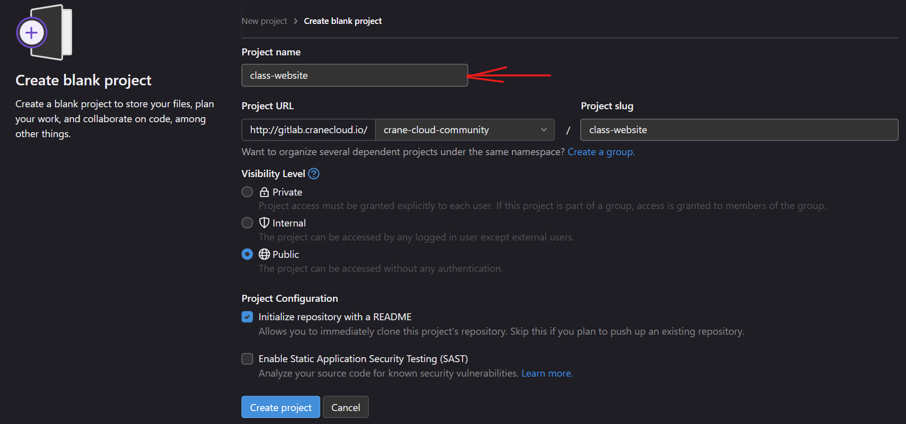
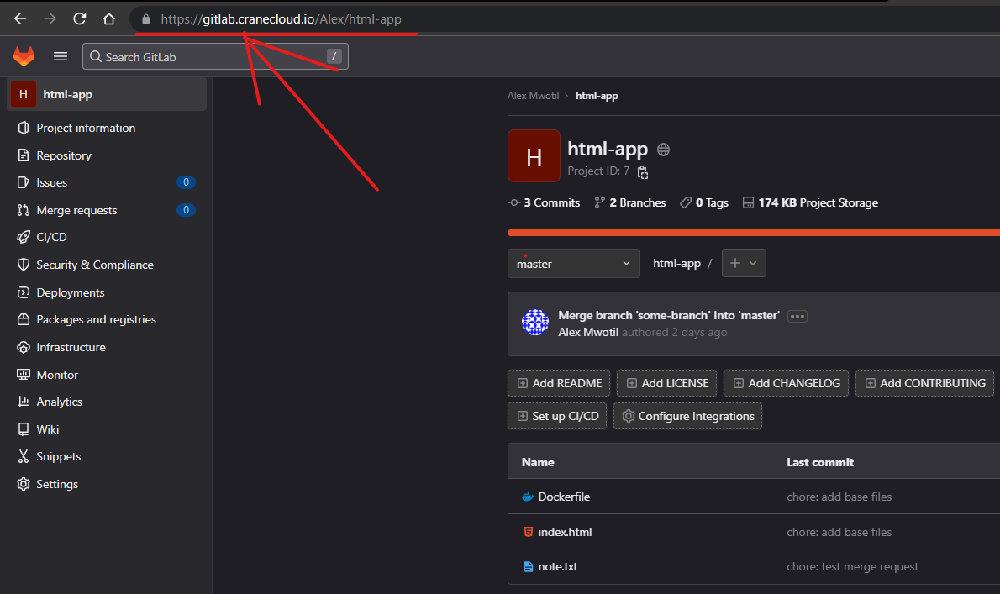

Our [Self Managed GitLab](https://gitlab.cranecloud.io) provides a wide range of features that can be used to manage your projects including all the core features such as version control, issue-tracking, code review, CI/CD, wiki and security scanning among others. This guide will help you get started with the self-managed GitLab.

## Authentication

To access the self-managed GitLab, you need to have an account. If you don't have one, you can create one when you visit the platform [here](https://gitlab.cranecloud.io/users/sign_up). Once you have an account, you can login to the self-managed GitLab [here](https://gitlab.cranecloud.io/users/sign_in) page as shown in figure 1.


Figure 1: GitLab CE login page

## Dashboard

After logging in as a new user, the following screen should appear where you are given the following options

- Creating a project

- Creating a group

- Exploring public projects


Figure 2: GitLab CE dashboard

## Initial configuration of the portal

The initial configuration involves changing a few portal settings. First, turn off open registration for everyone so that only users authorized by the admin can complete registration. This can be done by clicking the view settings button available on the upper bar with a warning. On the new page, uncheck Sign-up enabled and save the changes.

The next step should be to change the root user. To do this go under profile and then account settings and enter the name in the Change username field. Approve by clicking on Update username.

The last step will be the change password under the profile page, enter a temporary and new password and then approve the change by clicking save password.

## Create a new project

After the initial configuration, we can create our first project. To do this, go to the page at projects/new and click create a blank project or Import project.


Figure 3: Project creation page

## Pushing code to a project

To push code from your local computer to a GitLab project, you need to have a GitLab account and a project created. If you don't have an account, you can create one [here](https://gitlab.cranecloud.io/users/sign_up) and if you don't have a project, you can create one [here](https://gitlab.cranecloud.io/projects/new) as shown in Figure 5.



Figure 4: Creating a project

Once you have an account and a project, you can push code to the project by following the steps below.

- Open your terminal and navigate to the directory that contains your code and run the following command

```bash
git init
```

- Add the files in your new local repository. This stages them for the first commit.

```bash
git add .
```

- Commit the files that you've staged in your local repository.

```bash
git commit -m "First commit"
```

- In the terminal, add the URL for the remote repository where your local repository will be pushed.

```bash
git remote add origin https://gitlab.cranecloud.io/username/projectname.git
```

NOTE: Replace `username` with your username and `projectname` with the name of the project you want to push to.

- Push the changes in your local repository to GitLab.

```bash
git push -u origin master
```

## Importing a project

You can alternatively import a project by selecting `Import project`, then providing the Git repository URL address. After a while, your first repository will be copied to your Gitlab.


Figure 5: Project Import

## Creating a CI/CD pipeline

To create a CI/CD pipeline for the project, click the main menu on the left, CI/CD, and then Editor. An option to create a `.gitlab-ci.yml` file, which will contain our pipeline definitions, will appear on the screen. This file will be created in the Git repository.

Once the CI file is committed and approved, GitLab will launch the process. To check the results, go to CI/CD -> pipelines in the menu on the left. On the screen, we should see that our first task has already been started.

We can go to the details of this task by clicking on the pending button or build number #1. After a while, the task should be built and tested.

## Cloning a Project

To clone a project, consider copying the url in the browser search bar at the top while in the root view/initial view of the project as shown below



Figure 6: URL used to clone a project

Then open your terminal and navigate to the directory where you want to clone the project and run the following command

```bash
git clone https://gitlab.cranecloud.io/username/projectname.git
```

NOTE: Replace `username` with your username and `projectname` with the name of the project you want to clone.
