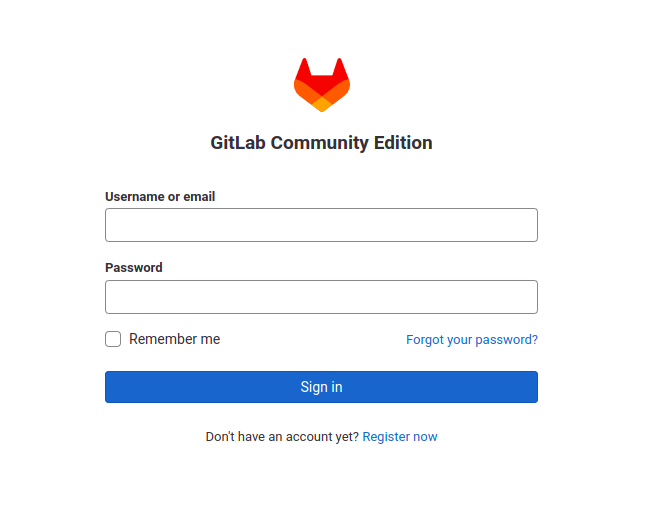
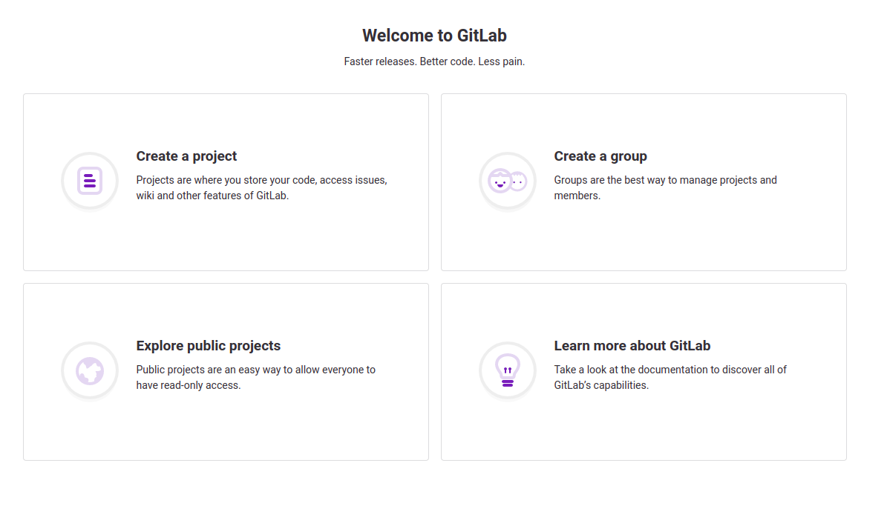
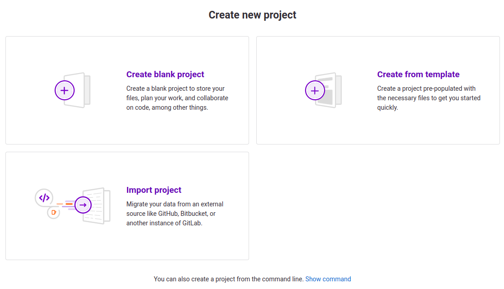
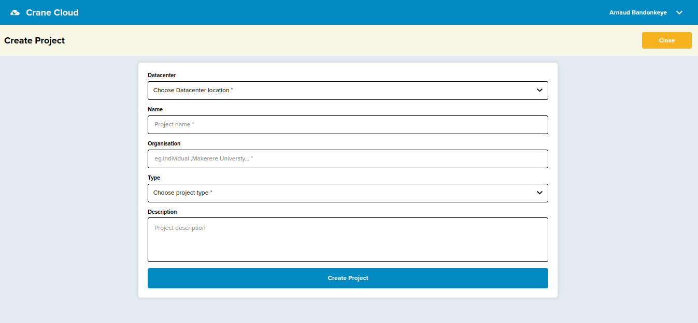
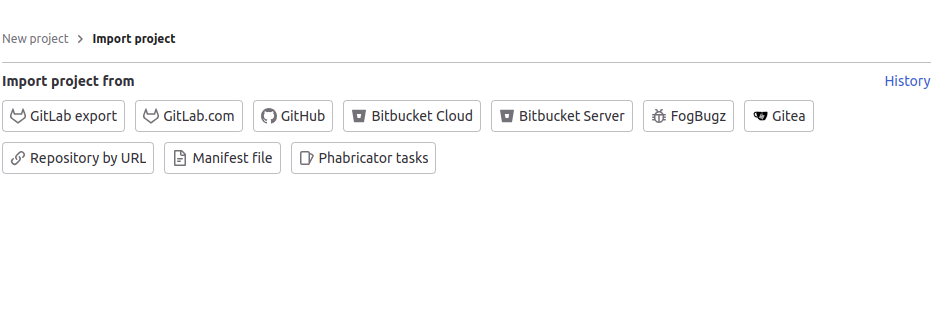
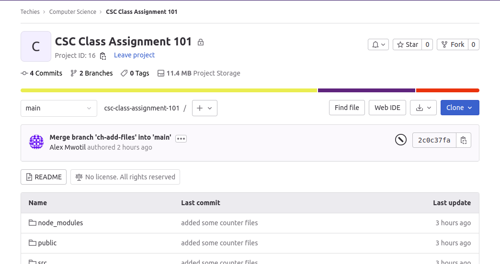
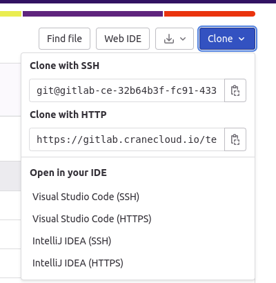
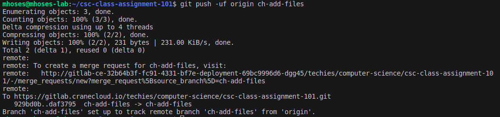

Our [Self Managed GitLab](https://gitlab.cranecloud.io) provides a wide range of features that can be used to manage your projects including all the core features such as version control, issue-tracking, code review, CI/CD, wiki and security scanning among others. This guide will help you get started with the self-managed GitLab.

## Authentication

To access the self-managed GitLab, you need to have an account. If you don't have one, you can create one when you visit the platform [here](https://gitlab.cranecloud.io/users/sign_up). Once you have an account, you can login to the self-managed GitLab [here](https://gitlab.cranecloud.io/users/sign_in) page as shown in figure 1.



Figure 1: GitLab CE login page

## Dashboard

After logging in as a new user, the following screen should appear where you are given the following options

- Creating a project

- Creating a group

- Exploring public projects



Figure 2: GitLab CE dashboard

## Initial configuration of the portal

The initial configuration involves changing a few portal settings. First, turn off open registration for everyone so that only users authorized by the admin can complete registration. This can be done by clicking the view settings button available on the upper bar with a warning. On the new page, uncheck Sign-up enabled and save the changes.

The next step should be to change the root user. To do this go under profile and then account settings and enter the name in the Change username field. Approve by clicking on Update username.

The last step will be the change password under the profile page, enter a temporary and new password and then approve the change by clicking save password.

## Create a new project

After the initial configuration, we can create our first project. To do this, go to the page at projects/new and click create a blank project or Import project.



Figure 3: Project creation page


Optionally, creating a blank project you are required to type a name for your project, choose the visibility level and also the project configuration. After all the creation descriptions you click the `create project` button.



Figure 4: Project description


## Importing a project

You can alternatively import a project by selecting `Import project`, then providing the Git repository URL address. After a while, your first repository will be copied to your Gitlab. This is another way to create a project.



Figure 5: Import Project 


## Cloning a Project

You can clone a project from to your local computer, or to a codespace, to make it easier to add or remove files, and  push larger commits. When you clone a project, you copy the project from Gitlab to your local machine, or to a remote virtual machine when you create a codespace. 

## Cloning steps
1. On Gitlab navigate to the main page of the project.
2. Above the list of files, click  `Clone`.

    

    Figure 6: `Clone` dropdown menu

3. Copy the URL for the project.

    

    Figure 6: URL used to clone a project


    - To clone the project using HTTPS, besides "HTTPS", click the clipboard to copy the url.

    - To clone the project using an SSH key,  click the clipboard besides SSH.

4. Open Terminal.

5. Change the current working directory to the location where you want the cloned directory.

6. Type `git clone`, and then paste the URL you copied earlier.

```bash
git clone https://gitlab.cranecloud.io/techies/computer-science/csc-class-assignment-101.git
```
NOTE: When cloning the project from the gitlab, you are prompted to comfirm with your username and then later your password. This is to ensure a privacy and code security.

## Pushing code to a project

To push code from your local computer to a GitLab project, you will need to have access to a project. Simply create a project on [Gitlab.](https://gitlab.cranecloud.io/projects/new) as shown in Figure 3. If you already have a project to push code to then you follow the steps below.

Open your terminal and navigate to the directory that contains your code with the `cd` command and run then following commands :

 - Initialize the current directory has a git repository. It means in this local project you can now run the git commands.

```bash
git init
```

- Add the files in your new local repository. This stages them for the first commit.

```bash
git add .
```

- Commit the files that you've staged in your local repository.

```bash
git commit -m "First commit"
```

- In the terminal, add the URL for the remote repository where your local repository will be pushed.

```bash
git remote add origin https://gitlab.cranecloud.io/username/projectname.git
```

NOTE: Replace `username` with your username and `projectname` with the name of the project you want to push to.

- Push the changes in your local repository to GitLab.

```bash
git push -u origin master
```


Figure 7: Pushing local changes to remote project on Gitlab.
