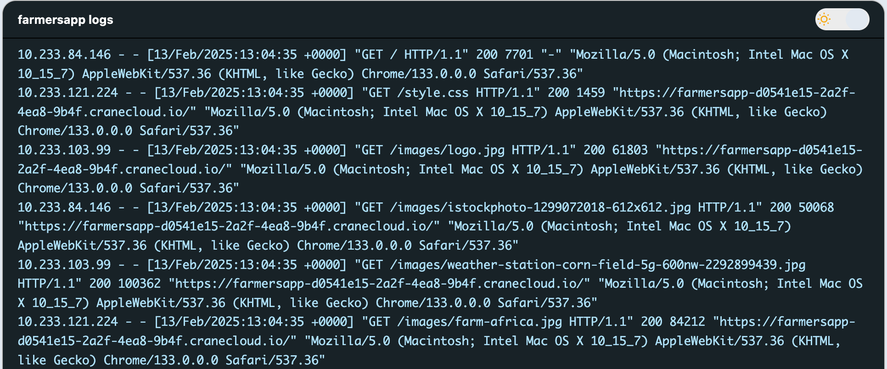

# Application monitoring on Crane Cloud

## Accesing metrics for an application
All application metrics can be accessed through the `Side Bar` that is located on the left of the app dashboard page under the `Metrics` section.

## CPU
Under the `Metrics` section, the application CPU metrics page can be accessed by clicking the `CPU` in the sidebar.

The page similar to the one below will be shown.
 
**Figure 1: Shows a graph detailing the application CPU usage for a day.**

This below shows the application CPU usage for a week (7 days).
 
**Figure 2: Shows a graph detailing the application CPU usage for a week.**

## Memory
Under the `Metrics` section, the application memory metrics page can be accessed by clicking the `Memory` in the sidebar.
 
The page similar to the one below will be shown.
 
**Figure 1: Shows a graph detailing the application memory usage for a day.**

This below shows the application Memory usage for a week(7 days).
 
**Figure 2: Shows a graph detailing the application memory usage for a week.**

This below shows the application Memory usage for a month.
 
**Figure 3: Shows a graph detailing the application memory usage for a month.**

## Network
Under the `Metrics` section, the application network metrics page can be accessed by clicking the `Network` in the sidebar.
 
The page similar to the one below will be shown.
 
**Figure 1: Shows a graph detailing the application network usage for a day.**

## Logs
Under the `Metrics` section, the application logs page can be accessed by clicking the `Logs` in the sidebar.

The page similar to the one below will be shown.
 
**Figure 1: Shows the application logs.**