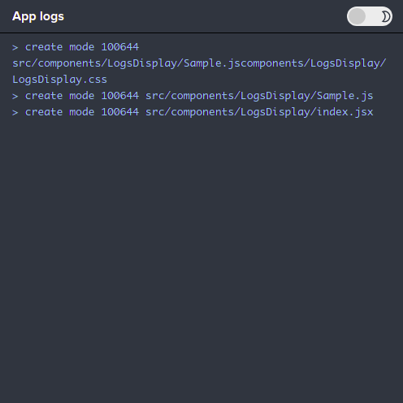

# APPLICATION MONITORING

## Accesing Application Metrics
1. All applications metrics can be accessed through the side bar that is located at the right hand
  side of the apps page of a selected app.
  

## Metrics Page
1. The Metrics page can be accessed by clicking the *METRICS* link in the sidebar.
  

2.The page similar to the one below will be shown.
  
  This shows a brief preview of the various metrics graphs.

## CPU Page
1. The CPU page can be accessed by clicking the *CPU* in the sidebar.
  

2.The page similar to the one below will be shown.
  
  This shows a graph detailing the application CPU usage for a day.

3.This below shows the application CPU usage for a week(7 days).
   

## Memory Page
1. The Memory page can be accessed by clicking the *Memory* in the sidebar.
  

2.The page similar to the one below will be shown.
  
  This shows a graph detailing the application Memory usage for a day.

3.This below shows the application Memory usage for a week(7 days).
   

4.This below shows the application Memory usage for a month.
   

## Network Page
1. The Network page can be accessed by clicking the *Network* in the sidebar.
  

2.The page similar to the one below will be shown.
  
  
  This shows a graph detailing the application Network usage for a day.

## Logs Page
1. The logs page can be accessed by clicking the *Logs* in the sidebar.
   

2. The theme of the logs page can be changed to dark and switched back basing on ones preference by clicking on the toggle button at the top right side of the page. 

   