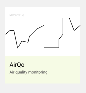
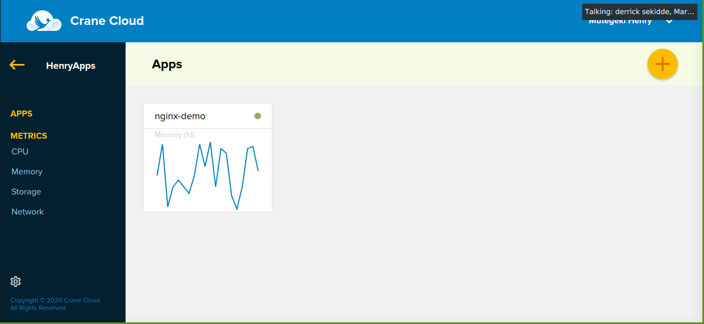
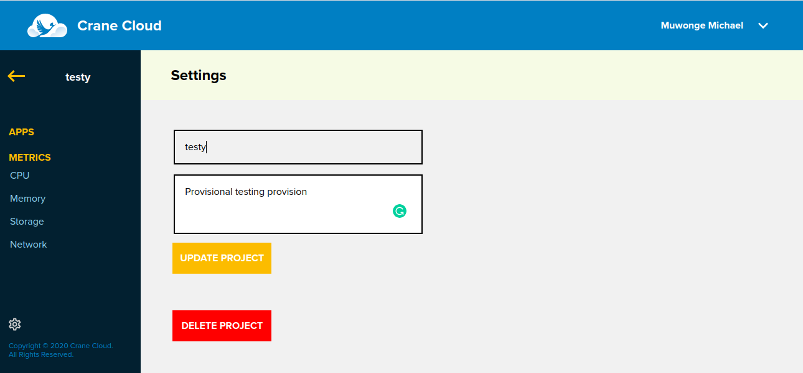
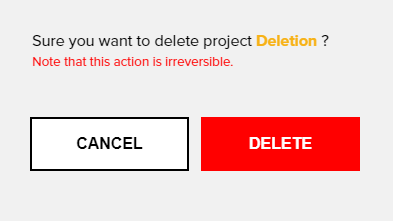

# PROJECT DETAILS

## Projects Naming Convention 
1. All project names should start with a letter.

2. Project names are only unique for a given user

## Editing A Project

1. To edit your project, click on the project card.

    

2. Once inside the project,an apps page appears similar to that one below.

    

3. On the apps page, click on the settings icon on the bottom left corner of the page, on clicking the icon, a page appears similar to the one below.

    

4. If you only edit the description, the proceed button will not work. Otherwise when you either edit the project name only or both the name and the description and click the proceed button, the effects will have been affected.

    

## Deleting A Project

1. To delete a project, click on the project card.

    

2. Once inside the project,an apps page appears similar to that one below.

    

3. On the apps page, click on the settings icon on the bottom left corner of the page. 

    

4. That takes you to the page below that has a "Delete Project" button. Click the *Delete Project* button.

    

5. On clicking the button, a modal appears prompting you to go ahead and delete the project.

    

*** Once you click the delete button, you will be unable to recover the deleted project. ***

## Project Creation  Errors

**Note: The following errors may occur when creating Projects**

1. In case the project name you entered contains space or symbols you will get this error below.

2. If you do not fill one of the modal fields, you get this error.

3. When you try to create a project with the same name as one of your existing projects you will get this error.   

4. When the project name exceeds 22 characters, you will get the error below.
g