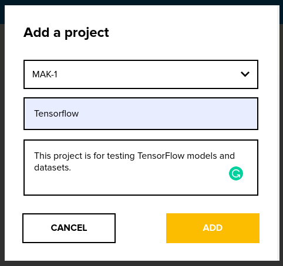
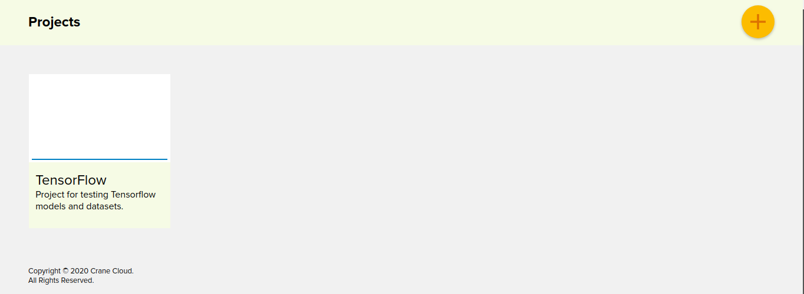
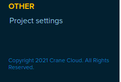
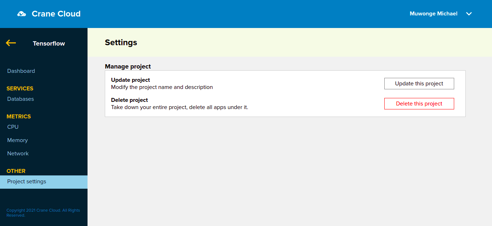
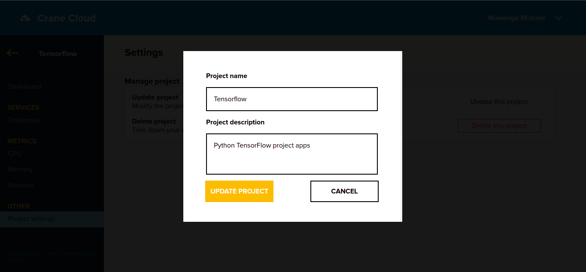
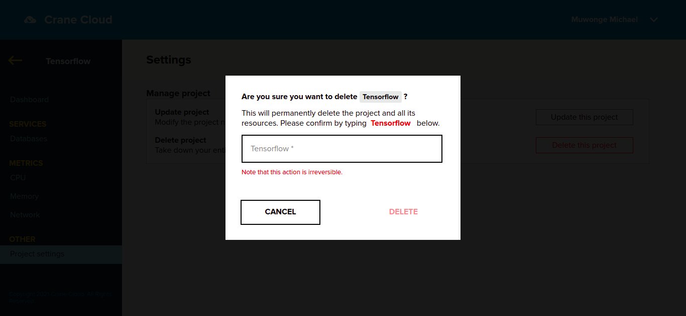
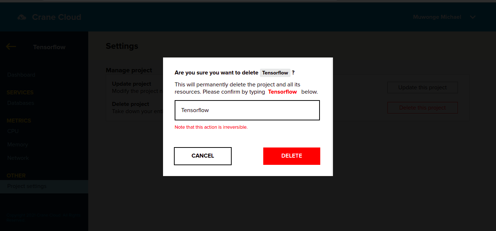
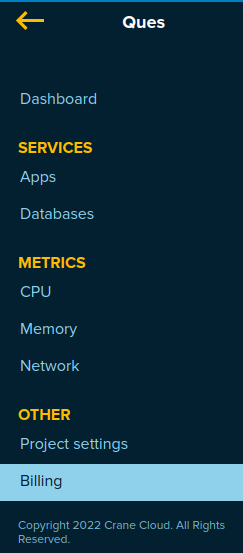
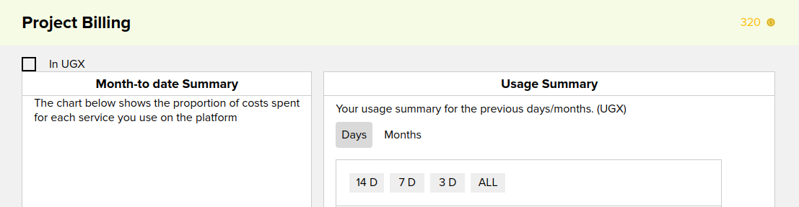

# PROJECT DETAILS

## Projects Naming Convention

1. All project names should start with a letter.

2. Project names are only unique for a given user

## Create A Project

1. To create a project, navigate to the User dashboard, click on the `ADD` button at the top right hand side of the screen.
   

2. Once the button is clicked, a modal containing a form to create a project. Let us use a case study: Create a Tensorflow project.

   - Select Datacenter location from available locations.
   - Enter project name.
   - Enter project's organisation
   - Enter project type
   - Enter project Description.
   - Click the `Create Project` button to submit the form.
   - The page will reload and display your newly created project.

   

3. Once the project has been successfully created it will show in the user dashboard.
   

4. To access a particular project, click on the project card to drill in.

## Editing A Project

1. To edit your project, click on the project card.

   

2. Once inside the project,an apps page appears similar to that one below.

   

3. On the apps page, click on the settings icon on the bottom left corner of the page.

   

4. The project settings page will appear.

   

5. You can choose to edit the project name or description.

   

## Deleting A Project

1. To delete a project, click on the project card.

   

2. Once inside the project,an apps page appears similar to that one below.

   

3. On the apps page, click on the settings icon on the bottom left corner of the page.

   

4. That takes you to the page below that has a "Delete Project" button. Click the _Delete Project_ button.

   

5. On clicking the button, a modal appears prompting you to go ahead retype the project name after which the delete but will be enabled for you to commence with deleting the project.

   
   

**_ Once you click the delete button, you will be unable to recover the deleted project. _**

## Project Creation Errors

**Note: The following errors may occur when creating Projects**

1. In case the project name you entered contains space or symbols you will get this error below.
   

2. If you do not fill one of the modal fields, you get this error.
   

3. When you try to create a project with the same name as one of your existing projects you will get this error.  
   

4. When the project name exceeds 18 characters, you will get the error below.
   

## Project Billing

1. To get your project billing information, while inside a project click `Billing` on the sidebar.

   

2. On the right side of the sidebar a similar page will appear showing the available metrics for the project.

   

3. In case you need to make payment for your app usage then click the pay bill button. Note the button remains disabled util a particular threshold is attained.

   

4. After selecting the payment methods you can go ahead to make payment and you will recieve an email showing for your payment receipt. In the dashboard you can be able to view transactions, invoices and receipts and all these can be downloaded. Below is a example of a receipt with the provision of being able to download it as a PDF.

   

   

5. You can pay using assigned credits and your credits can be viewed on the page too.

   
