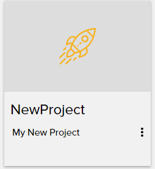
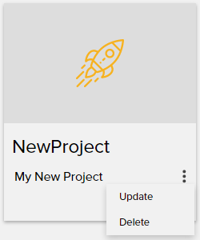
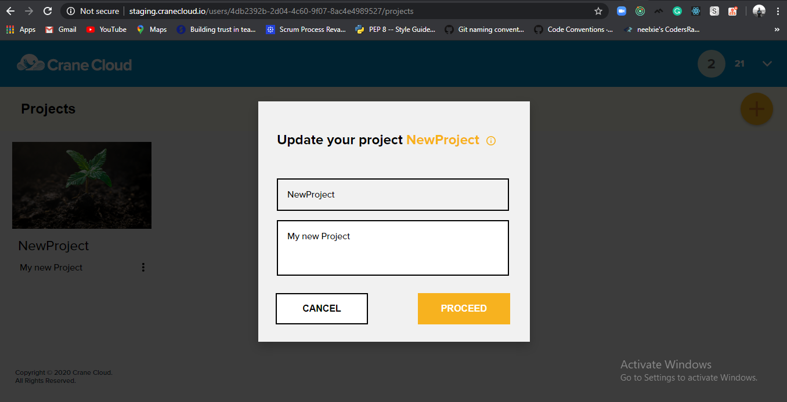
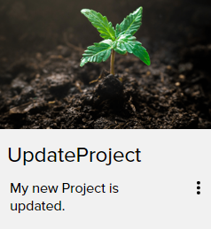

# PROJECT DETAILS

## Projects Naming Convention 
1. All project names should start with a letter.

2. Project names are only unique for a given user

## Editing A Project

1. To edit your project, click the 3(three) dots on the bottom right-hand side of the project card.

    

2. A context menu appears on which you click the update option of the menu.

    

3. On clicking the option a modal form appears similar to the one below.

    

4. If you do not edit either the project name or description the proceed button will not work. When you click the proceed button, the effects will have been affected.

    

## Deleting A Project

1. To delete a project, click the 3(three) dots on the bottom right-hand side of the project card.

    

2. A context menu appears on which you click the delete option of the menu.

    

3. A  modal appears prompting you to go ahead and delete the project.

    

*** Once you click the delete button, you will be unable to recover the deleted project. ***

## Project Creation  Errors

**Note: The following errors may occur when creating Projects**

1. In case the project name you entered contains space or symbols you will get this error below.

2. If you do not fill one of the modal fields, you get this error.

3. When you try to create a project with the same name as one of your existing projects you will get this error.   

