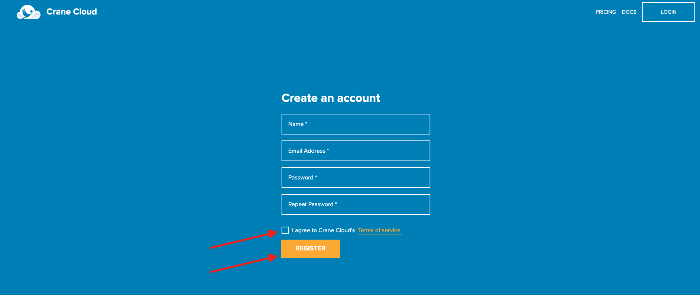
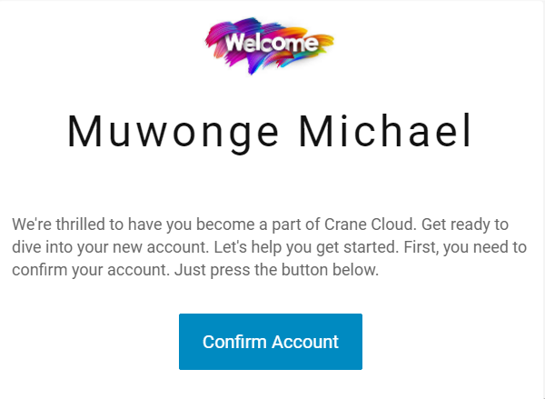
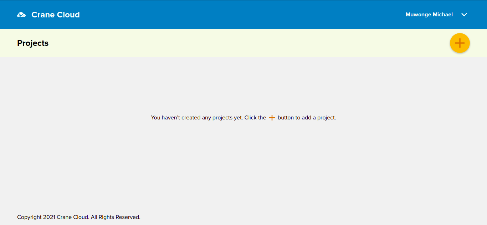
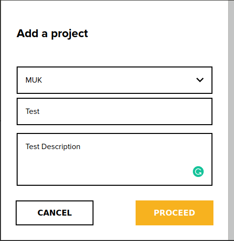
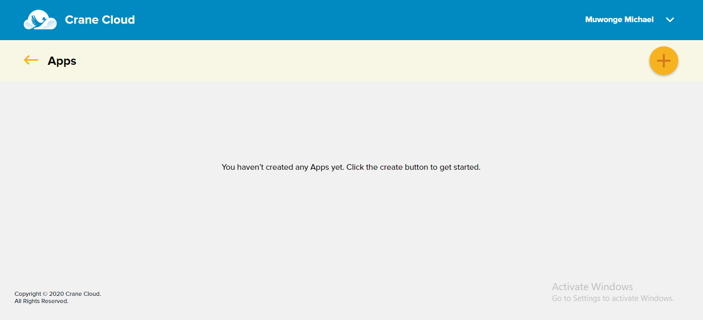

# Quickstart

## Registration
1. Visit <http://staging.cranecloud.io/> and click the `GET STARTED Button`

2. Fill in all the required information, agree to terms and conditions and click `Register`

3. Upon successfull registration a confirmation link is sent to the email address you registered with, head over to your email and click the link. Remember to check the junk folder as well. 

4. The registration confirmation link will lead you to your dashboard(Projects). If you are a return use, you will need to login to get to the dashbaord. 

## Email Confirmation
1. Your account verification email will look like this below. 

2. All that is required of you is to click the `Confirm Account` button in the email.

## Create Project
1. Login into your account and click the `orange Create button` at the top right corner of your dashboard. 

2. It will pop up a modal containing a form to create a project. 

3. First, `select a cluster` where your project will reside. Fill in the form with `Project Name` and `Project description` and click `PROCEED` to submit.
           

4. Your Page will auto reload to display the newly created project.

## Create Application
1. To create an application, you need click on a project card to drill into that project.  

2. Then, click the `Create button` on the top right corner of your applications' dashboard, to display create application Form.

3. It will pop up a modal containing a form to create an application. Let us use a case study: Deploy a simple Nginx hello world application, with a public image `nginxdemos/hello` on Dockerhub. 

    - Enter the application name 
    - Select number of replicas for your app.
    - Enter the image url 
    - Submit the form.
    - The page will reload and display your newly created application. 
    
    

## Access Application
1. Navigate into your project to view a list of applications you created under that project.
    

2. To access a particular application, click on the URL attached to its card. The green dot on the application card symbolizes that the application is running. 