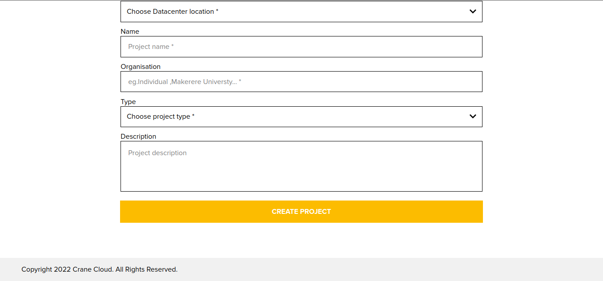
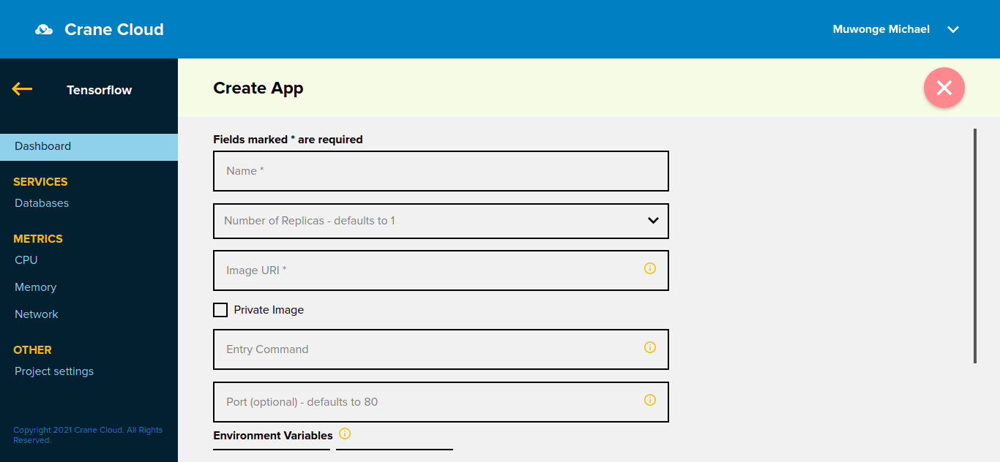
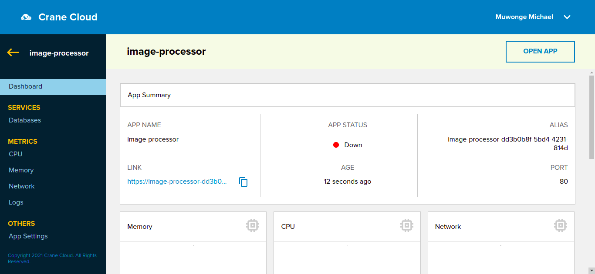
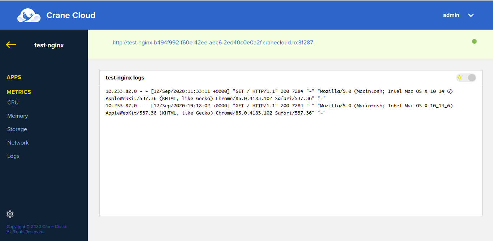

# Quickstart

## Registration
1. Visit <https://cranecloud.io/> and click the `START FREE TRIAL`

2. Fill in all the required information, agree to terms and conditions and click `Register` or signup with Github.

3. Upon successfull registration a confirmation link is sent to the email address you registered with, head over to your email and click the link. Remember to check the spam folder in case you can see the email. 

4. The registration confirmation link will lead you to your dashboard(Projects). If you are a return use, you will need to login to get to the dashboard. 

## Email Confirmation
1. Your account verification email will look like this below. 

2. All that is required of you is to click the `Confirm Account` button in the email.

## Create Project
1. To create a project, click the `Create button` on the top right corner of your User dashboard, to display create project Form.

2. It will pop up a modal containing a form to create a project. Let us use a case study: Create a Tensorflow project. 

    - Select Datacenter location from available locations.
    - Enter project name.
    - Enter project's organisation
    - Enter project type
    - Enter project Description.
    - Click the `Create Project` button to submit the form.
    - The page will reload and display your newly created project. 
    
    
    

## Access Project
1. Navigate to your User Dashboard to view a list of projects you have.
    

2. To access a particular project, click on the project card. 

## Create Application
1. To create an application, you need click on a project card to drill into that project.  

2. Then, click the `Create button` on the top right corner of your applications' dashboard, to display create application Form.

3. It will pop up a modal containing a form to create an application. Let us use a case study: Deploy a simple Nginx hello world application, with a public image `nginxdemos/hello` on Dockerhub. 

    - Enter the application name 
    - Select number of replicas for your app.
    - Enter the image url -- for example docker image url could be `nginxdemos/hello`
    - Entry command if any
    - Enter port if applicable 
    - Enter environment variables if any
    - Submit the form.
    - The page will reload and display your newly created application. 
    metrics

    

## Access Application
1. Navigate into your project to view a list of applications you created under that project.

    

2. To access a particular application, click on the URL attached to its card. The green dot on the application card symbolizes that the application is running. 

## Monitor Project
1. Navigate through your project and click on `METRICS` to access all the metrics through the side bar.

    

2. To access particular metrics, click on the desired metrics in the side bar either CPU, Memory, storage or Network and they will be displayed.

## Monitor Application
1. Navigate through your project, select the application of interest and click on `METRICS` to access all the metrics through the side bar.

2. To access specific app metrics, click on the desired metrics in the side bar either CPU, Memory, storage, Network or logs and they will be displayed.
    

    
## Add your domain to application
1. To add your domain to your hosted application, kindly reach out to us at `dorothy@cranecloud.io` and checkout instructions under applications.
